# What's Cooking?

"What's Cooking?" is a public online blog-style platform where users can find recipes shared by food-loving people from around the globe. If someone wants to share their recipe or be able to comment and like others', they can register and log in. 

This interactive platform is designed to be an inspiration for those days when you don't know what to cook or simply want to try something new.

# Table of Contents
- [Database Diagram](#database-diagram)
  - [Planning](#planning)
  - [Final Result](#final-result)

- [Design](#design)
  - [Colour Scheme](#colour-scheme)
  - [Button Styling](#button-styling)

- [Technologies Used](#technologies-used)
  - [Languages](#languages)
  - [Frameworks, Libraries and Programs](#frameworks-libraries-and-programs)

- [Features](#features)
  - [Existing Features](#existing-features)
  - [Future Features](#future-features)

- [Testing](#testing)
  - [Validator Testing](#validator-testing)
  - [Responsivness & Browser Compability Testing](#responsivness--browser-compability-testing)
  - [Manual Testing](#manual-testing)
  - [Testing of User Stories](#testing-of-user-stories)
  - [Lighthouse Testing](#lighthouse)

- [Fixed Bugs](#fixed-bugs)

- [Credits](#credits)
  - [Media](#media)
  - [Content](#content)
  - [Acknowledgements](#acknowledgements)

- [Deployment](#deployment)

- [Development](#development)
  - [Fork](#fork)
  - [Clone](#clone)

  
## Database Diagram

The database model diagram was designed using [Lucidchart]("https://www.lucidchart.com/pages/sv"). The first draft of the entity relationship diagram is nearly the same as the models used in the final database. 

### Planning

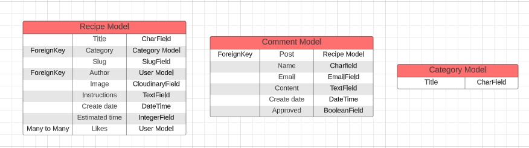

At this stage, the ingredients an servings fields are missing.

### Final Result

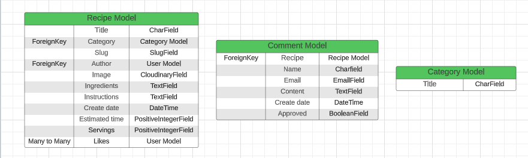

#### Recipe Model
  - The main model that contains all the fields needed for the recipe to be complete. Of course you can add other fields (like cooking time, difficulty level, nutritional value, and so on), but that values are not vital for the site to work and can be added later.
  - Is based on the "I think therefore I blog" walkthrough project. Some adjustments and additions were made to fit the needs of my project.

#### Comment Model
  - Enable logged-in users to add comments to different recipes.
  - Is based on the "I think therefore I blog" walkthrough project.

#### Category Model
  - The custom model.
  - Enable users to place recipes in different categories.
  - Make it possible to "sort" recipes by categories.

[Back to top ⇧](#table-of-contents)


## User Experience

I used the design thinking approach to create a clutter-free website with only necessary information, making it easy for users to navigate. 

To maximize the user approach, I interviewed my friend Josefine throughout the process. Among other things, she provided valuable tips on displaying categories on each recipe card, which indeed makes the user experience better.


Five planes of User Experience:

### Strategy

My User stories can be found [here](https://github.com/Kattis91/what-is-cooking/issues).

Please, click [here](#testing-of-user-stories) if you want to come to the section where I test my User Stories.

#### Key Project Goal

Planning what to cook can be a struggle for many. The key project goal of the blog is to establish a visually appealing and user-friendly open-source recipe database. It should not be challenging for users to find what they are looking for. 

Therefore, I have included **categories** on the homepage of the site: 

  - It is a useful feature for users who have a specific food preference and do not want to waste time browsing through all the recipes. By clicking on a category, they can easily find dishes that meet their specific criteria, such as vegetarian dishes. This leads to a more efficient and enjoyable user experience.

  - As for those who don't know what they want, seeing categories can help them narrow down their choices and ultimately get some inspiration and ideas.

With easy-to-follow links, the site is highly navigable.

#### Target Audience

The best part of the blog is that it caters to almost everyone. Of course, you need to be old enough to be in the kitchen.

Whether you are uncertain about meal choices, a food-lover seeking culinary knowledge, or simply a "hungry" person desiring to learn new recipes, tips, and cooking techniques, everybody is welcome!

#### User Requirements and Expectations:

- A brief and simple description of the site’s purpose.

- Easy to navigate the site to find information.

- A quick and thorough overview of the site's features and functionalities.

- Links and functions work as expected.

- Feedback when ineracting with the site.

- Possibility to view the site on a range of device sizes.

### Scope

#### Content | Functionality Requirements:

- Easily accessible navigation bar with the links that have easily understandable names.

- Responsive design.

- A brief and simple description of the site’s purpose.

- A complete collection of recipes.

- A thorough list of ingredients and step-by-step instructions to follow.

- A possibility to sort recipes by categories.

- A possibility to read comments.

#### Authentication:

- Add registration/login features that give the user access to extra functionality.

- Add Logout functionality for safety reasons.

#### Functionality for logged-in users:

  - **CRUD functionality:**

    - Implement feature that allows user to **C**reate recipes.

    - Implement feature that allows user to **R**ead recipes.

    - Implement feature that allows user to **U**pdate recipes.

    - Implement feature that allows user to **D**elete recipes.

  - **Comment and like feature:**

    - Enable logged-in users to post comments on any of the published recipes.

    - Enable logged-in users to like/unlike published recipes.


### Structure

The blog is divided into different pages. Some of the pages are accessible only for logged in users. The blog structure allows users to access recipes via the recipes page or by sorting them through different categories. All users can access detailed information about each recipe by clicking on the recipe card. Users who are logged in can publish, edit, and delete their own recipes, and interact with other recipes by liking and commenting on them.

**For detailed information about all existing features see the section [Existing Features](#existing-features).**


### Skeleton

I created wireframes using [Figma](https://www.figma.com/).

<details>
<summary>Home page</summary>

LEFT: all users | RIGHT: logged-in users.

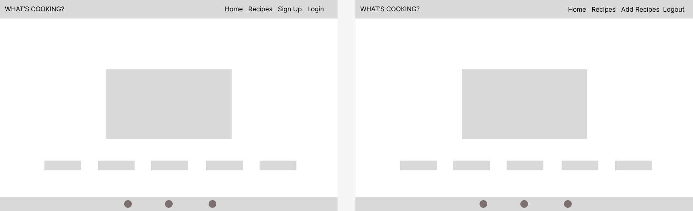

</details>

<details>
<summary>Recipe page</summary>

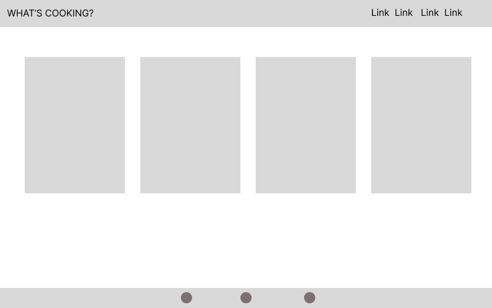

</details>

<details>
<summary>Recipe detail page</summary>

LEFT: all users | RIGHT: logged-in users.

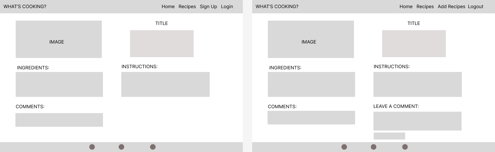

</details>

<details>
<summary>Add a Recipe page</summary>


</details>

<details>

<summary>Sign Up</summary>

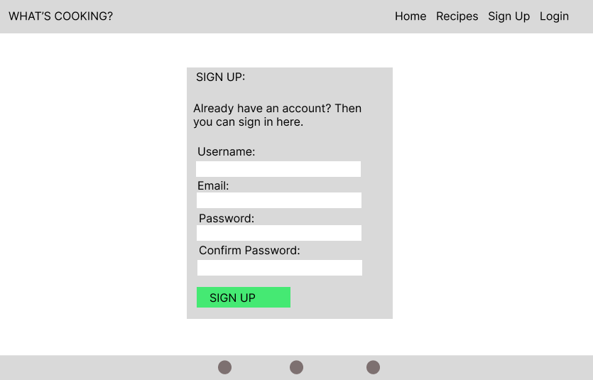

</details>

<details>
<summary>Login</summary>

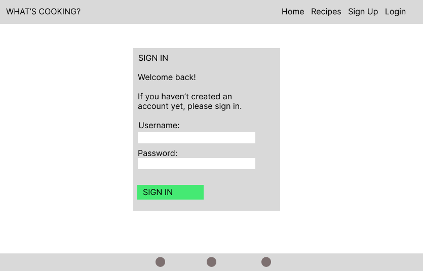

</details>

<details>
<summary>Logout</summary>

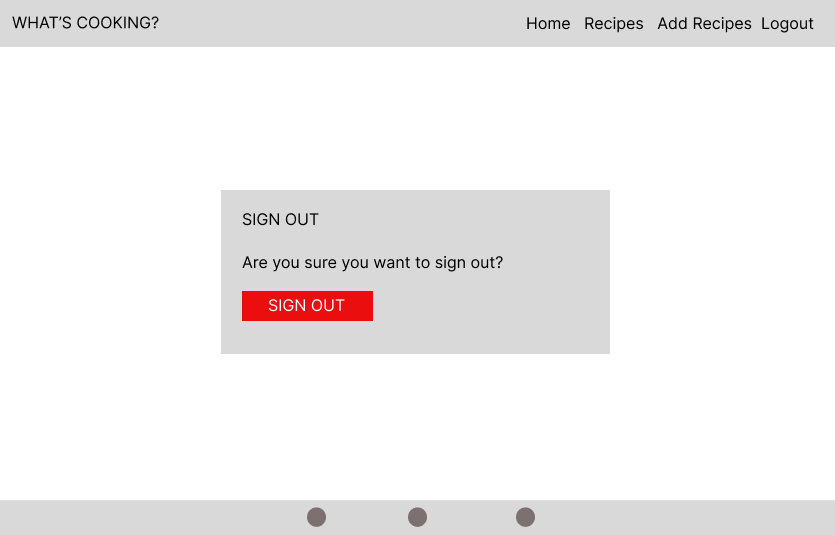

</details>
 

## Design

### Colour Scheme

The choice of colors depends on the background image chosen for home, sign up, login, and logout pages.

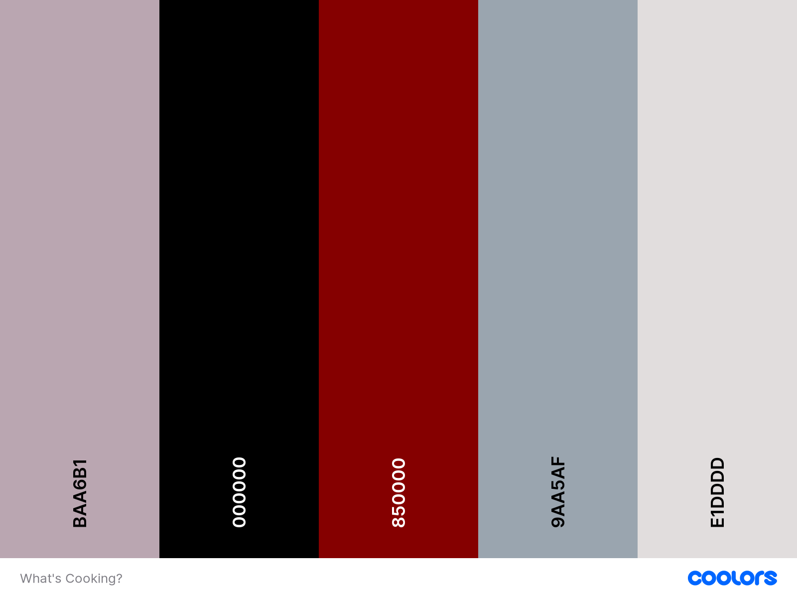

 - **`9AA5AF`** is the primary color used throughout the pages:
   - Welcome message.
   - Category boxes on the home page.
   - Recipe cards.
   - Add | Edit recipe forms.
   - Sign Up | Login | Logout forms.
   - Confirmation message when choosing to delete a recipe.
  
 - **`BAA6B1`** is used to style the navbar, the footer and the "View Recipe" button.

 - **`000000`** is the primary text color used throughout the pages.

 - **`850000`** is used for links and hover styling on navbar and footer. The color was chosen with the help of [Color Contrast Analyzer](https://dequeuniversity.com/rules/axe/4.7/color-contrast) (provided by Lighthouse testing) in order for background and foreground colors to have a sufficient contrast ratio.

 - **`E1DDDD`** is used as the background color for all recipe-related pages including recipes, recipe details, add recipe, edit recipe and categories.

 ### Button styling

All buttons throughout the pages have the same styling, ensuring uniformity and providing a seamless user experience. 
 
I went with following colors:
  - `GREEN` that usually is associated with "YES" | "SAVE" | "OK".
  - `#850000` that usually is associated with "NO" | "CANCEL" | "GO BACK".
  - `WHITE` for the text in order to get a sufficient contrast ratio.

    
  
<details>

<summary>Click here to see all the buttons</summary>

- Sign up: 
    
  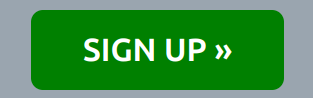

- Sign in:
   
  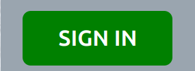
  
- Logout:

  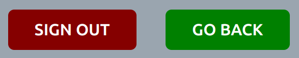

- Add a recipe:

  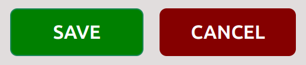

- Update a recipe:

  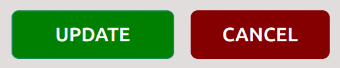

- Delete confirmation:

  

- Edit | Delete:

  

- Submit (when leaving a comment):

  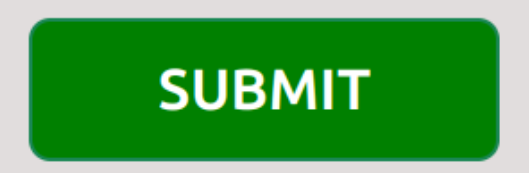

</details>

#### Typography

[Google Fonts](https://fonts.google.com/) was used to import the chosen fonts for use in the site. 
[Typ.io](https://typ.io/) was used to see what fonts go together.

- I have used **"Bitter"** for all the headings throughout the pages.

  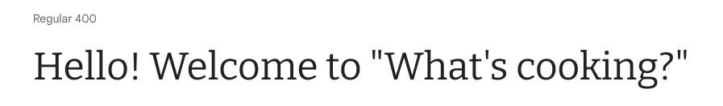

- For the paragraphs I went with **"Opens Sans"**

  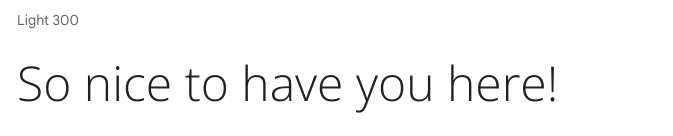


## Technologies Used

### Languages
 
  - HTML
  - CSS
  - Python
  - JavaScript

### Frameworks, Libraries and Programs

  - [Django](https://www.djangoproject.com/)
   
  - [Django-Allauth](https://docs.allauth.org/en/latest/)
    - used for User authenticaion (sign up, sign in and sign out features).

  - [Django Crispy Forms](https://django-crispy-forms.readthedocs.io/en/latest/)
    - used to control rendering behaviour of Django forms.

  - [Gunicorn](https://docs.djangoproject.com/en/4.2/howto/deployment/wsgi/gunicorn/)
    - Python HTTP server for WSGI applications.
  
  - [psycopg2](https://pypi.org/project/psycopg2/)
    - PostgreSQL database adapter for the Python programming language.
  
  - [Summernote](https://summernote.org/)
    - WYSIWYG editor. Used for ingredients and instruction fields on the Admin site and instructions field in the "Add a recipe" form.

  - [WhiteNoise](https://whitenoise.readthedocs.io/en/latest/index.html)
    - The library that allows the web app to serve its static files.

  - [ElepantSQL](https://www.elephantsql.com/)
    - The database used by the deployed project on Heroku.

  - [Cloudinary](https://cloudinary.com/)
    - The cloud platform used to store static media files.

  - [Git](https://git-scm.com/)
    - used for version controll.

  - [GitPod](https://www.gitpod.io/)
    - The IDE used to create the site.

  - [GitHub](https://github.com/)
    - The code hosting platform used to save and store the files for the website.

  - [Heroku](https://www.heroku.com/)
    - The cloud platform used to deploy the project into live environment.

  - [Bootstrap](https://getbootstrap.com/)
    - The front-end development framework used for styling along with custom CSS.
  
  - [Lucidchart](https://www.lucidchart.com/pages/sv)
    - The diagramming application used to create ERD diagrams.


## Features

### Existing Features

#### Navigation Bar

- The navigation bar is complete and responsive. It appears consistently on every page, making navigation more convenient.

- This section facilitates seamless navigation between pages, eliminating the need to rely on the "back button".

- Clicking on the Logo and "Home" will always redirect the user to the home page.

- When the user clicks on "Recipes", they will be directed to a page containing all available recipes,

- Logo and links to the home and recipes pages are **available for all users**. However, there are some differences in how the navigation bar looks for non-logged and logged-in users.
 
  - **Non-logged users:**

    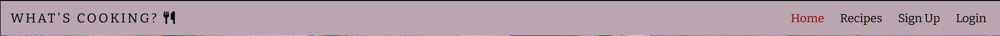
    
    - The navigation bar contains links for the Logo, Home, Recipes, Sign Up, and Login pages.
    - Clicking "Sign Up" or "Login" directs users to the pages with respective forms.

  - **Logged-in users:**
    
    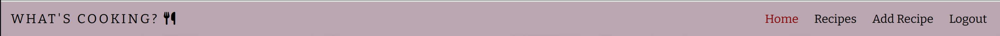

    - The navigation bar contains links for the Logo, Home, Recipes, Add Recipe, and Logout pages.
    - Clicking "Add Recipe" takes the user to a page where they can fill in a form to publish a recipe.
    - Clicking "Logout" directs users to the confirmation page.

#### Welcome message

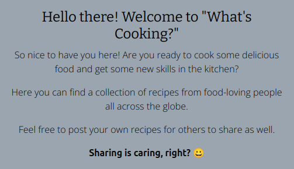

- This section welcomes users to the blog.

- Tells users that:
  - It is a recipe blog.
  - It is possible to publish own recipes.

#### Categories


- This section shows all the categories available right now.

- Clicking on a category redirects the user to all recipes within that category. The "BACK" button takes the user back to the homepage.
  
  - There are some recipes available:
    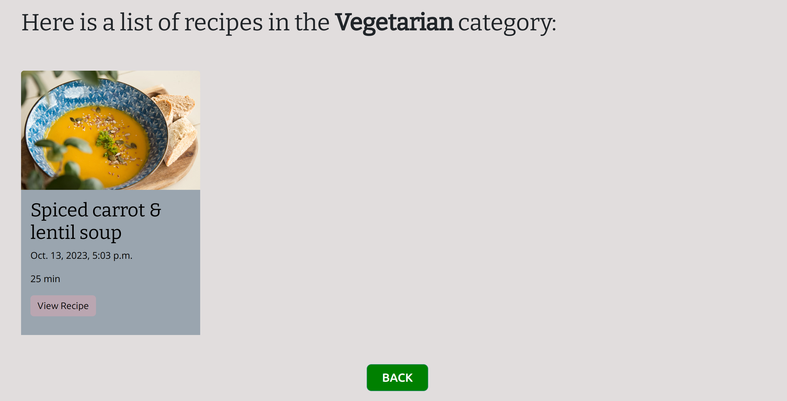

  - No recipes are available within the selected category.
     
    - Logged-in users:
      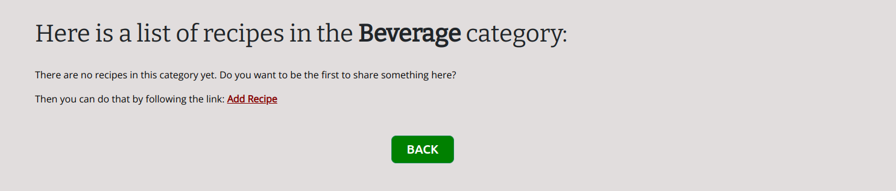

    - Unlogged users:
      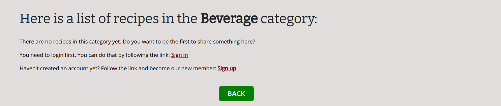


#### Footer


- This section contains links to the appropriate social media platforms. By clicking on them, they will open in a new tab.

- The footer remains consistent across all pages.

#### Sign Up

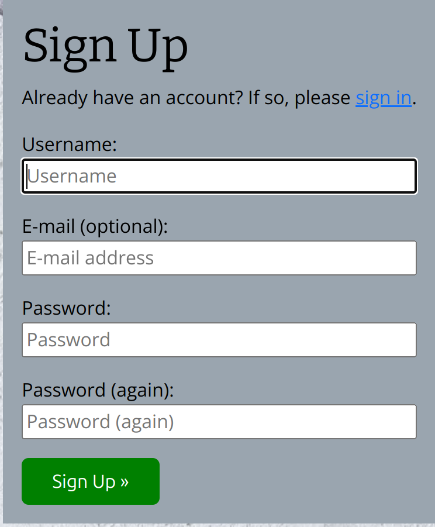

- The form enables users to register and create an account.

- The form includes following fields:
  - Username
  - Email
  - Password
  - Password (again)

- Email field is optional.

#### Login

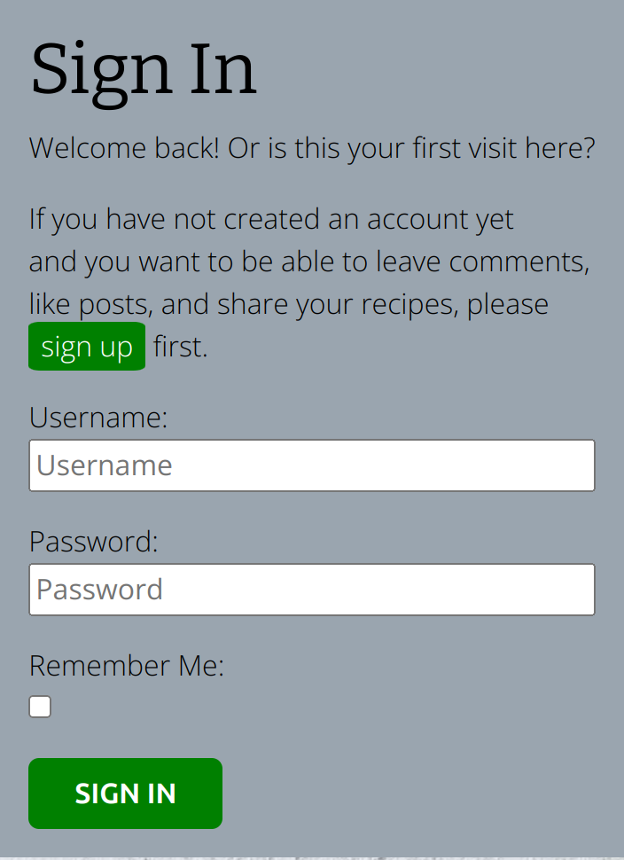

- The form enables users to log in.

- When a user logs in, they gain the ability to:
  - comment on existing recipes,
  - create new recipes.
  - edit/delete their own recipes.

- A message indicating that the operation was successful is shown on the screen.

#### Logout

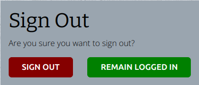

- When the user clicks on Logout in the navbar, they are redirected to a page displaying a confirmation message above.

  - Sign Out:
    - The user redirects to the home page.
    - A message indicating that the operation was successful is shown on the screen.

  - Go Back:
    - The user redirects to the home page.


#### Recipes page

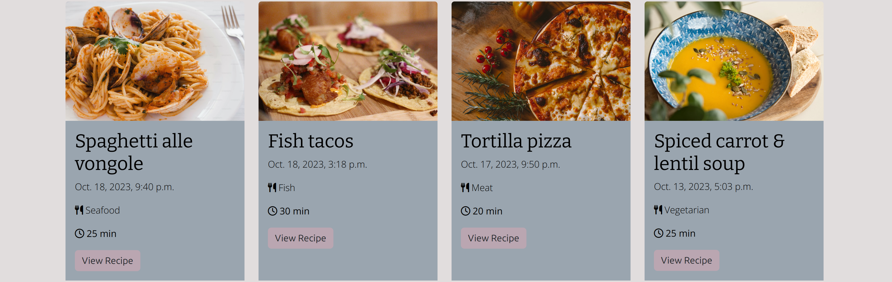

- This page shows a list of all the published recipes.

- Information displayed:
  - recipe image;
  - recipe title;
  - create date;
  - category;
  - estimated time of cooking;
  - "View Recipe" button.

- By clicking on each recipe, the user redirects to a page containing detailed information about that specific recipe.

#### Recipe detail page

The recipe detail page includes the following information:

  - The recipe image (or the default image if the recipe image doesn't load).
  
  - Information field containing some extra information for recipe authors.
    
    - Available for all users:
    
      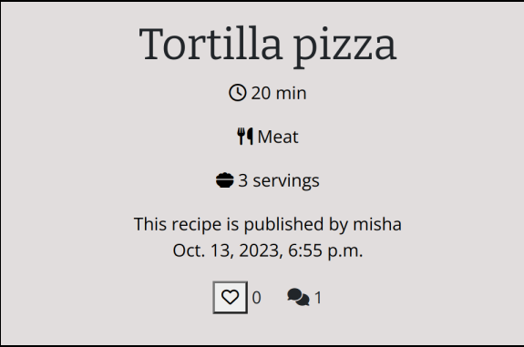

      - recipe title;
      - estimated time of cooking;
      - category;
      - number of servings;
      - recipe author;
      - create date;
      - likes icon:
        - logged-in users can like recipes;
        - no-logged users can only see the number of likes.
      - comment icon that shows the number of comments on the selected recipe.
    
    - Extra functionality for the recipe authors:
   
      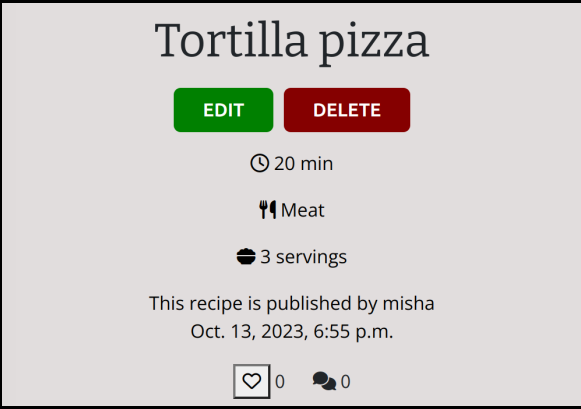

      - EDIT
        - By clicking the "EDIT" button, the user is redirected to the page with a form where they can edit the recipe posted by them.
        - The form has the same fields as the "Add a Recipe" form.
        - All the form fields are prepopulated.
      
      - DELETE
        - By clicking the "DELETE" button, the user is redirected to the page where they get a question about whether they are sure that they want to delete the recipe.
       
          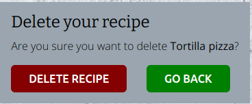
          - The recipe gets deleted when the user clicks the "DELETE RECIPE" button. The user is redirected to the home page.
          - The user is redirected to the home page when clicked the "GO BACK" button.

  - Ingredients section.

  - Instructions section.

  - Comments section:
    
    - There are some comments left:

      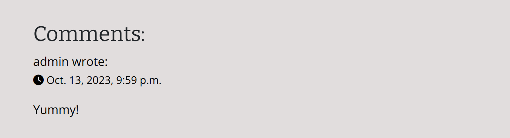
    
    - There are NO comments left:

      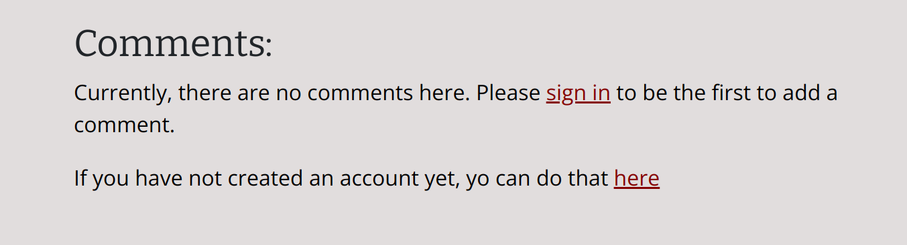

    - Leave a comment (available ONLY for logged-in users):

      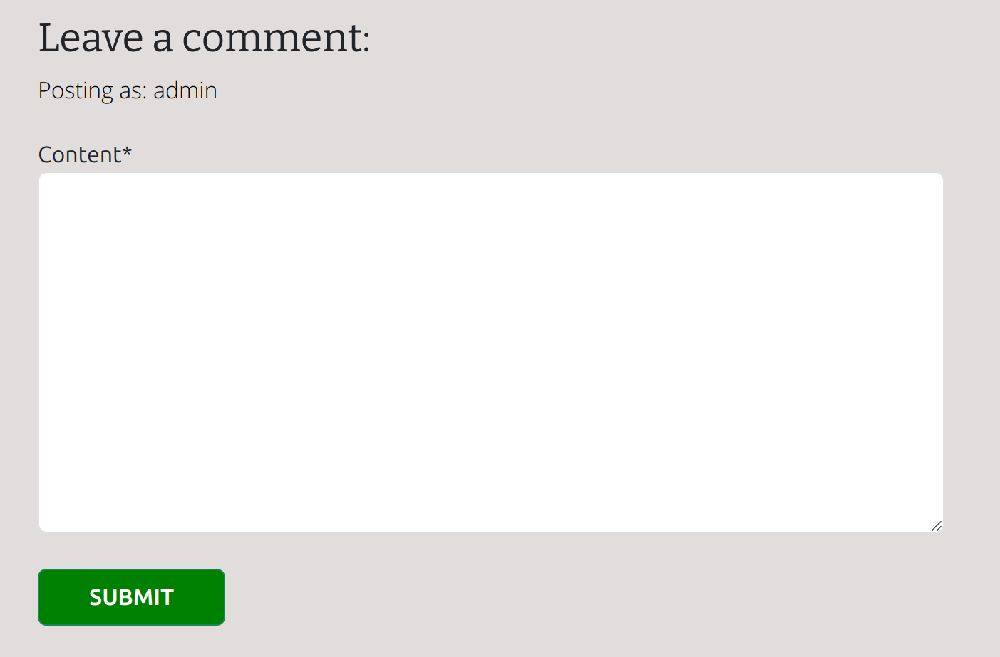

#### Add a Recipe page

- This page includes a form that allows users who are logged in to publish their own recipes.

- Available fields:
  - Title
  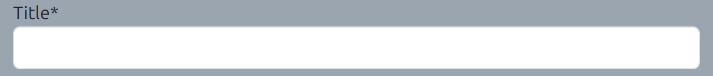
  - Category (Dropdown menu)
  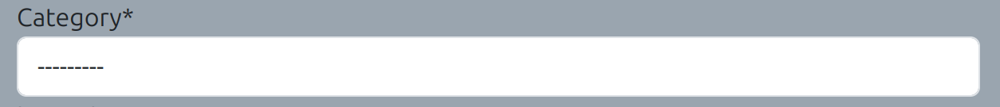
  - Image
  
  - Ingredients
  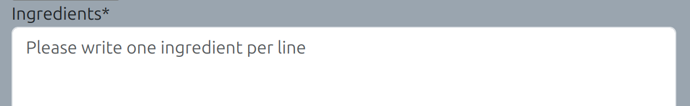
  - Instructions (Summernote field)
  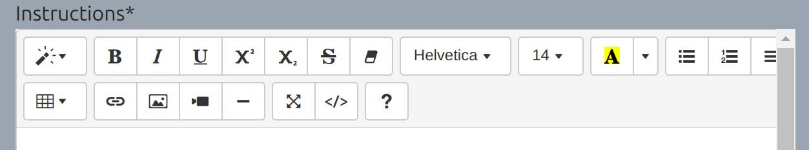
  - Estimated time
  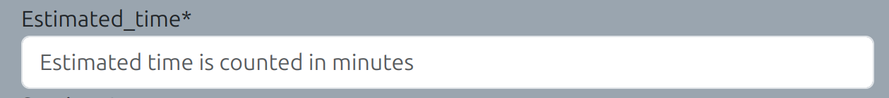
  - Servings
  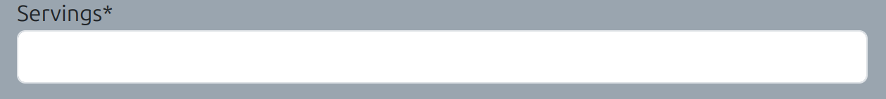
  
  - Buttons

    
   
    - SAVE:

      - After correctly submitting the form, the user will be redirected to the recipes page upon clicking the save button.

      - A success message is displayed to the user.

    - "CANCEL" button:

       - When the user clicks on the 'go back' button, they will be redirected to the recipes page.


### Future Features

- Make it possible for logged-in users to save recipes as their favorites.

- Add a feature that allows users to click on the author's name and view all the recipes published by that author.

- Add some other choices, like difficulty level, meal type, cuisine.

- Enable users to log in using their social media accounts.

## Testing

### Validator Testing

- **HTML**. Validator: [W3C Validator](https://validator.w3.org/).
  
  - **Home Page**
    
    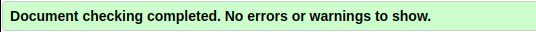

  - **Sign Up**
    
    

  - **Login**
    
    
  
  - **Logout**
    
    
    
  - **Recipes Page**
    
    

  - **Recipe detail page**
    
    

  - **Category**
      
    
    
    No errors or warnings to show for either of these three cases:
    - There are recipes within the selected category.
    - There are no recipes within the selected category. The user is logged in.
    - There are no recipes within the selected category. The user is not logged in.

  - **Add recipe page | Update Recipe page**
  
    All errors listed by W3Validator are related to Summernote, and not any code written by me. Errors are the same for both "Add Recipe" page and "Update Recipe" page.Research conducted within the Code Institute community indicates that this is a common occurrence, and therefore it should be noted. However, no action needs to be taken in response.

    <details>

    <summary>Click here to see the errors.</summary>
      
      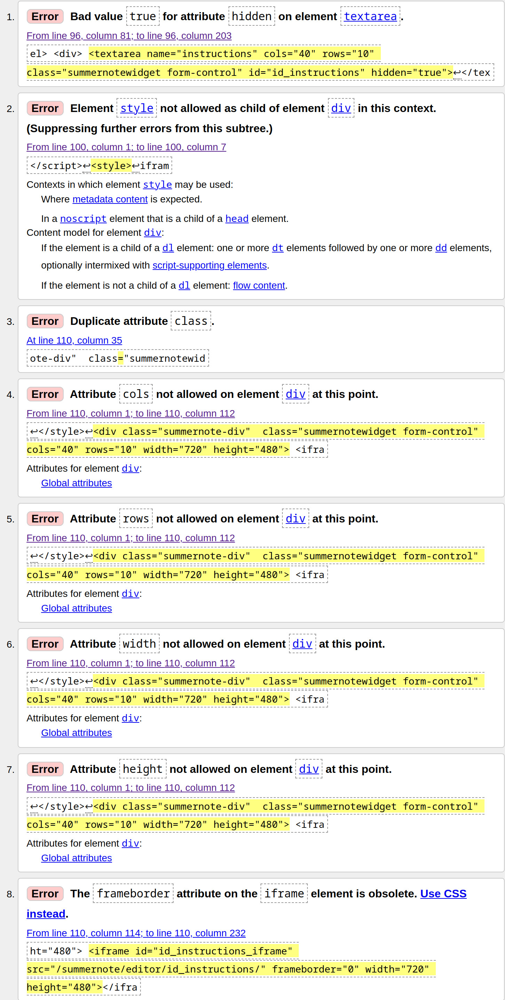

    </details>
  
  - **Delete recipe page**

    

  - **404.html**
    
    


- **CSS**. Validator: [Jigsaw Validator](https://jigsaw.w3.org/css-validator/validator).
  
  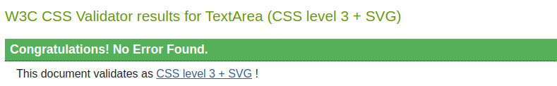

- **JavaScript**. Validator: [JSHint Validator](https://jshint.com/).
  - No errors were found when passing through the validator.
  - Validator gave warnings about one undefined variable(Bootstrap). No action is taken because this custom bootstrap variable does not need to be defined within the script.

    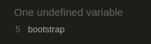

- **PYTHON**. Validator: [CI Python Linter](https://pep8ci.herokuapp.com/).
Only files with custom-written Python code have been verified with the validator. All the files tested got the result below.

  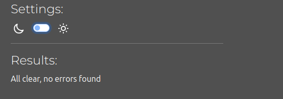
 
  - **admin.py** 
    - All clear, no errors found.
  
  - **models.py**
    - All clear, no errors found.

  - **forms.py**
    - All clear, no errors found.

  - **views.py**
    - All clear, no errors found.

  - **whatscooking/urls.py**
    - All clear, no errors found.

  - **blog/urls.py**
    - All clear, no errors found.

### Responsivness & Browser Compability Testing

- In order to thoroughly test my website, I conducted a series of tests on various browsers including Google Chrome, Safari, and Mozilla Firefox.

- I also tested on multiple devices such as:
  - Laptop:
    - Dell xps 13.
  - Mobile Devices:
    - iPhone XS, 
    - iPhone 13 Pro, 
    - Samsung Galaxy S10.

- I made sure to check every page using Google Chrome developer tools to confirm their responsiveness on various screen sizes.

### Manual Testing

<details><summary>Navigation bar and footer (base.html)</summary>

| Feature | Expect | Action | Result | Pass/Fail |
|---------|--------|--------|--------|-----------|
| Navigation Bar. **Logo** (available for all users) | When the user clicks "WHAT'S COOKING?", they should be redirected to the homepage of the site. | Click on "WHAT'S COOKING?" in the navigation bar at the left top of the page. | The user is redirected to the home page of the site. | Pass |
| Navigation Bar. **Home** (available for all users) | When the user clicks "Home", they should be redirected to the homepage of the site. | Click on Home in the navigation bar at the top of the page. | The user is redirected to the home page of the site. | Pass |
| Navigation Bar. **Recipes** (available for all users) | When the user clicks "Recipes", they should be redirected to the recipes page of the site. | Click on Recipes in the navigation bar at the top of the page. | The user is redirected to the recipes page of the site. | Pass |
| Navigation Bar. **Sign Up** (available for all users) | When the user clicks "Sign Up" they should be redirected to the registration page. | Click on Sign Up in the navigation bar at the top of the page | The user is redirected to the registration page. | Pass |
| Navigation Bar. **Login** (available for all users) | When the user clicks "Sign In" they should be redirected to the sign in page. | Click on Sign In in the navigation bar at the top of the page. | The user is redirected to the sign in page. | Pass |
| Navigation Bar. **Add Recipe** (available for only logged-in users) | When the user clicks "Add Recipe", they should be redirected to a form page to submit their recipe. | Click on Add Recipe in the navigation bar at the top of the page. | The user is redirected to the form page. | Pass |
| Navigation Bar. **Logout** (available for only logged-in users) | When the user clicks "Logout", they should be redirected to a confirmation page before signing out. | Click on Logout in the navigation bar at the top of the page. | The user is redirected to the sign out confirmation page. | Pass |
| Link to Facebook (icon)| When clicked, links to a Facebook page in a new tab. | Click on the Facebook icon in the footer of the page. | Facebook page opens in a new tab. | Pass |
| Link to Instagram (icon) | When clicked, links to an Instagram page in a new tab.| Click on the Instagram icon in the footer of the page. | Instagram page opens in a new tab. | Pass |
| Link to TikTok (icon) | When clicked, links to a Tiktok page in a new tab. | Click on the TikTok icon in the footer of the page. | TikTok page opens in a new tab. | Pass |
| Link to YouTube (icon) | When clicked, links to a YoutTube page in a new tab.| Click on the Youtube icon in the footer of the page. | YouTube page opens in a new tab. | Pass |
</details>

<details> 
<summary>Success messages (feedback to the user)</summary>

*All the messages automatically disappear after 3 seconds.

| Feature | Expect | Action | Result |
|---------|--------|--------|--------|
| Sign Up / Login | When a user successfully signs up, a message indicating success should appear and disappear automatically*. | Click the Sign Up link in the navbar. | 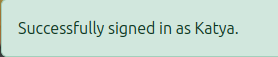 |
| Login | When a user successfully logs in, a message indicating success should appear and disappear automatically*. | Click the Login link in the navbar. |  | 
| Logout | When a user successfully logs out, a message indicating success should appear and disappear automatically*. | Click the Logout link in the navbar. |  | 
| Posting a recipe | When a user successfully posts a recipe, a message indicating success should appear and disappear automatically*. | Go to the "Add Recipe" page, fill out each field accurately, and press "SAVE". | 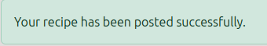 | 
| Updating a recipe | When a user successfully updates a recipe, a message indicating success should appear and disappear automatically*. | Go to one of the recipes posted by you, click the "EDIT" button, make some changes and press "UPDATE". | 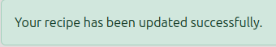 |
| Deleting a recipe | When a user successfully deletes a recipe, a message indicating success should appear and disappear automatically*. | Go to one of the recipes posted by you, click the "DELETE" button, and then "DELETE RECIPE" when being asked if you are sure. | 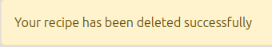 | 
</details>

<details> 
<summary>Home page</summary>

| Feature | Expect | Action | Result | Pass/Fail |
|---------|--------|--------|--------|-----------|
| Categories | Each category box should be clickable. When the user clicks on a category, they should be directed to a page containing recipes only from that category. | Click on a category on the home page. | The user is directed to the page with the recipes within the chosen category. | Pass |
| Categories. No recipes. Logged-in users | If there are categories with no recipes yet, the user should get a clear message about that, along with the link to the "Add recipe" page. | Click on a category on the home page. | The user is directed to the page with the recipes within the chosen category. If there are no recipes available in the selected category, the user can see a message that reads "There are no recipes in this category yet. Do you want to be the first to share something here?" The message stating "Then you can do that by following the link: Add Recipe" is also displayed on the page. | Pass |
| Categories. No recipes. Unlogged users | If there are categories with no recipes yet, the user should get a clear message about that, along with the information that the user must be logged in to be able to post a recipe. | Click on a category on the home page. | The user is directed to the page with the recipes within the chosen category. If there are no recipes available in the selected category, the user can see a message that reads "There are no recipes in this category yet. Do you want to be the first to share something here?" Messages stating "You need to login first. You can do that by following the link: Sign In" and "Haven't created an account yet? Follow the link and become our new member: Sign Up" are also displayed on the page. | Pass |
| Categories. The "BACK" buton" | When the user is on the page with the recipes of the selected category, they should be able to click the "BACK" button to return to the home page of the site. | Click the "BACK" button on the page with the recipes of the selected category. | The user is directed to the home page of the site. | Pass |
</details>

<details> 
<summary>Recipes list page</summary>

| Feature | Expect | Action | Result | Pass/Fail |
|---------|--------|--------|--------|-----------|
| Pagination | Each page should display a maximum of 8 recipes. Every ninth recipe should start on a new page. If there are more than eight recipes, "NEXT" (if there is a next page) and "PREV" (if there is a previous page) buttons should be displayed on the bottom of the page. | Add more than eight recipes to the blog. | Only eight recipes are displayed on the first page. The screen displays a "Next" button, which, when clicked, leads the user to a page with more recipes and a "Previous" button. | Pass |
| Clicking on recipe | Each recipe should be clickable. When the user clicks on a recipe, they should be directed to a page containing detailed information about that recipe. | Click on the "View recipe" button. | The user is directed to a page displaying detailed information about the selected recipe. | Pass |
</details>

<details> 
<summary>Recipe detail page</summary>

| Feature | Expect | Action | Result | Pass/Fail |
|---------|--------|--------|--------|-----------|
| Information visible for all the users | Each recipe should display the image, preparation time, category, servings, author, creation date, and number of likes and comments. Ingredients, instructions, and comments should also be shown. | If you are currently logged in, make sure to log out. Go to the recipes page and click on the "View Recipe" button associated with the recipe that you want to view. | The image, preparation time, category, servings, author, creation date, number of likes and comments, ingredients, instructions, and comments are all displayed on the page. | Pass |
| No comments | If there are no comments on the recipe, the user should see a message saying that. | Find a recipe with zero comments. | The "Currently, there are no comments here. Please sign in to be the first to add a comment. If you have not created an account yet, you can do that here" message is displayed in the comments section. | Pass |
| Likes possibility for logged-in users | All logged-in users should be able to like/unlike all published recipes. The number of likes should increase when liking and decrease when pressing again. | Log in, go to the recipes page and click on the "View Recipe" button associated with the recipe that you want to view. Click on like button to like the recipe, click one more time to unlike.| The number of likes increase when liking and decrease when clicking like icon one more time. | Pass |
| Comment possibility for logged-in users | All logged-in users should be able to comment all published recipes. A message saying "Your comment is awaiting approval..." should be displayed on the screen. | Log in, go to the recipes page and click on the "View Recipe" button associated with the recipe that you want to view. Write a comment and click "Submit". | "Your comment is awaiting approval..." message appears on the screen. | Pass |
| Edit posibility for recipe authors | Recipe authors should be able to edit their recipes by updating the prepopulated form accessed through the "EDIT" button located under the recipe title. | Log in and publish a recipe. Click on the newly published recipe, then click "EDIT" to update and "SAVE". | The updated version of the recipe is published on the blog. | Pass |
| Delete posibility for recipe authors | Recipe authors should be able to delete their recipes by clicking the "DELETE" button located under the recipe title. The user should be redirected to a confirmation page where they are asked whether they are sure they want to delete the recipe or not. | Log in and publish a recipe. Click on the newly published recipe, then click "DELETE" button and "DELETE RECIPE" button on the confirmation page. | The recipe is successfully deleted. | Pass |
</details>

<details> 
<summary> Add a Recipe Page (Available for logged-in users only)</summary>

| Feature | Expect | Action | Result | Pass/Fail |
|---------|--------|--------|--------|-----------|
| Incomplete form | It shouldn't be possible to submit the form without first filling in all the fields. | Leave one or several fields empty and click the "Save" button. | The user remains on the "Add recipe page" until all the fields are filled in. | Pass |
| Estimated_time validation (greater than 0) | When trying to choose zero in the "estimated_time" field, the user should get a message saying "Please enter a value that is greater than zero". | Fill in the form and enter "0" into the "estimated_time" field. | "Please enter a value that is greater than zero" message appears below the field. | Pass |
| Servings validation (greater than 0) | When trying to choose zero in the "servings" field, the user should get a message saying "Please enter a value that is greater than zero". | Fill in the form and enter "0" into the "servings" field. | "Please enter a value that is greater than zero" message appears below the field. | Pass |
| Estimated_time validation (is less or equal to 600) | When trying to enter a value greater than 600 (min) into the "estimated_time" field, the user should get a message saying "Ensure this value is less than or equal to 600". | Fill in the form and enter a value greater than 600 into the "estimated_time" field. | "Ensure this value is less than or equal to 600" message appears below the field. | Pass |
| Servings validation (is less or equal to 50) | When trying to enter a value greater than 50 into the "servings" field, the user should get a message saying "Ensure this value is less than or equal to 50". | Fill in the form and enter some value greater than 50 into the "servings" field. | "Ensure this value is less than or equal to 50" message appears below the field. | Pass |
| Form submission | After successfully submitting the form, the user should be taken to the page displaying all published recipes. The newly published recipe should be shown in the top left corner. | Fill successfully in all the fields and click the "Save" button. | The user is redirected to the Recipes page. The newly published recipe is displayed as the first recipe on the page. | Pass |
| "Cancel" | By clicking the "Cancel" button, the user should be taken to the Recipes page. | Click the "Cancel" button. | The user is redirected to the Recipes page. | Pass |
</details>

<details> 
<summary>Sign Up</summary>

| Feature | Expect | Action | Result | Pass/Fail |
|---------|--------|--------|--------|-----------|
| Submit | After successfully submitting the sign up form, the user should be redirected to the homepage, where they can access links through the navigation menu available only for logged-in users. | Click on the "Sign Up" link in the navigation bar, fill in the form and click "Sign Up". | The user is directed to the homepage. "Home / Recipes / Sign Up / Login" links change to "Home / Recipes / Add Recipe / Logout". | Pass | 
| Submit without filling in the mandadory fields | When trying to submit the form without filling in mandatory fields, the user should get an ":exclamation: Please fill out this field" error message. | Click on the "Sign In" link in the navigation bar and then click the "Sign Up" button without filling in username, password or password(again) fields. | The ":exclamation: Please fill out this field" error message appears on the screen | Pass |
</details>

<details> 
<summary>Login</summary>

| Feature | Expect | Action | Result | Pass/Fail |
|---------|--------|--------|--------|-----------|
| Sign In | After successfully filling in the sign in form, the user should be redirected to the homepage, where they can access links through the navigation menu available only for logged-in users. | Click on the "Login" link in the navigation bar, fill in the form, and click "Sign In". | The user is directed to the homepage. "Home / Recipes / Sign Up / Login" links change to "Home / Recipes / Add Recipe / Logout". | Pass | 
| Sign In without filling in the mandadory fields | When trying to submit the form without filling in mandatory fields, the user should get an ":exclamation: Please fill out this field" error message. | Click on the "Login" link in the navigation bar and then click the "Sign in" button without filling in username or password fields. | The ":exclamation: Please fill out this field" error message appears on the screen | Pass |
</details>

<details> 
<summary>Logout</summary>

| Feature | Expect | Action | Result | Pass/Fail |
|---------|--------|--------|--------|-----------|
| Sign Out | By clicking on the Logout link, the user should be redirected to the confirmation page. | Click on the "Logout" link in the navigation bar. | The user is directed to the "Sign Out" page asking "Are you sure you want to sign out?". | Pass 
| "Are you sure you want to sign out?". **Sign Out** | Choosing to sign out, the user should be signed out and directed to the homepage, where they can access links through the navigation menu available for all users. | Click the "Sign Out" button. | The user is directed to the homepage. "Home / Recipes / Add Recipe / Logout" links change to "Home / Recipes / Sign Up / Login". | Pass |
| "Are you sure you want to sign out?". **Remain logged in** | Choosing to go back, the user should just be directed to the homepage. | Click the "Remain logged in" button. | The user is directed to the homepage. The user is still logged in. | Pass |
</details> 

### Testing of User Stories

- **I used Milestones to keep track on my EPICS**.

- Some of the "should-haves" and "could-haves" were completed before "must-haves" because that suited the workflow better. Despite this, I always kept track to ensure I didn't miss any of my "must-haves".

- I moved the "Choose between categories" User story from the "To Do" list to the "Doing" list twice. This was because I initially placed the category boxes on the homepage (no functionality here) before developing the view, adding a new URL, and creating the category.html page. It is still the same User story, but doing it the way I did made it easier for me to track my progress.

- One User story remains incomplete: "Sign in with Social Networks". This User story will not be done this time. This particular feature is not crucial or vital and can be postponed until the next opportunity. However, this functionality has been added to future features.

**To make it easier to follow, I tested User Stories in groups. First, those that belong to different Epics, then "must-haves", "should-haves" and last "could-haves."**

**EPIC: Authentication:**

| User Story | How are they achieved? |
|------------|------------------------|
| As a Site User I can register an account so that I can access publishing, commenting, and liking features. | The user can easily register by creating a username and password. The email field is optional. Upon successful registration, the user is automatically logged in. |
| As a Site User I can sign in with my username and password so that I can share my recipes and like/comment on others' | The user can log in using their registered username and password. The "Add Recipe" link appears in the navbar along with options to like/comment on recipes. |
| As a logged-in user I can easily log out so that I can avoid somebody else accessing my account. | The user can easily log out. User needs to confirm that they want to log out before it is done. |
| As a Site User I can get information whether an account with my chosen username already exists so that I can either use the login page instead (if it is my account) or choose another username. | 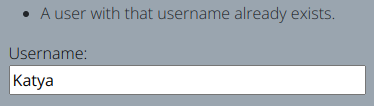 |

**EPIC: CRUD functionality:**

| User Story | How are they achieved? |
|------------|------------------------|
| As a logged-in User I can create/publish recipes so that I can share something I find delicious with others. | When logged in, the user can easily publish a recipe by clicking the "Add Recipe" link in the navbar and filling out the form. |
| As a Site user I can read published recipes so that I can get some inspiration. | The "Recipes" page is easily accessible from the navbar and provides detailed information for each recipe (the user just needs to click the "View Recipe" button).|
| As a logged-in User I can see what I have published so that I can correct and add information. | After publishing a recipe, the user is automatically redirected to the "Recipes" page where their recipe is displayed as the first one on the page. To update or add information to the recipe, the user can click on the "View Recipe" button followed by the "EDIT" button. This will take the user to a prepopulated form where they can make the desired changes.|
| As a logged-in User I can delete my recipes so that they are no longer published on the site. | If a user wants to delete a recipe they have published, they can simply choose the recipe, click on the "View Recipe" button, and then click on the "DELETE" button. After clicking on the "DELETE" button, the user will be taken to a confirmation page where they will have the option to either delete the recipe or go back to the detailed page. |

**EPIC: Administration:**

| User Story | How are they achieved? |
|------------|------------------------|
| As a Site Admin I can create, read, update and delete posts so that I can manage my blog content. | The admin of the site can publish recipes, and update/delete all the recipes regardless of who published them. |
| As a Site Admin I can view, approve, and delete comments so that I can remove any inappropriate content. | The admin of the site can easily view, approve, and delete comments. Comments are only published after admin approval. These features are accessible when logged in at "/admin". |

**"MUST_HAVES"**:

| User Story | How are they achieved? |
|------------|------------------------|
| As a Site User I can find navigation links at the top so that I easily can navigate the site. | Navbar links at the top of the page have easily understandable names. The navbar looks different for logged-in and unlogged users. Navbar is responsive and is presented in the form of a hamburger menu on smaller devices. |
| As a Site User I can get corresponding feedback after taking an action so that I know whether my actions were successfully run or not. |      |


**"SHOULD_HAVES"**:

| User Story | How are they achieved? |
|------------|------------------------|
| As a Site User I can choose between different categories so that I can decide what I would like to prepare and when. | All the categories are presented on the home page. Clicking on each category will take the user to a page that displays all the recipes within that category. If there are no recipes available in the selected category, the user will be presented with a clear message inviting them to be the first to post. |
| As a logged-in User I can like/unlike others' recipes so that I can interact with the content. | All logged-in users are able like/unlike all published recipes. The number of likes increases when liking and decrease when pressing again. |
| As a Site User I can view comments on an individual post so that I can read the conversation. | All the users can view comments that have been approved by the admin. If there are no comments yet, the user will be presented with a clear message about that. |
| As a logged-in User I can leave comments on recipes so that I can share my opinion/ask questions. | The comment form is visible to all logged-in users. After submission, a comment needs to be approved by the admin before it appears on the site. 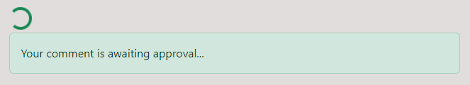 |

**"COULD_HAVES"**:

| User Story | How are they achieved? |
|------------|------------------------|
| As a Site User I can easily see the approximate required time to prepare each meal so that I can choose recipes and allocate my time accordingly. | The estimated time for preparing meals is visible on the page with all the recipes without the user needing to go to the detailed page. |
| As a Site User I can click on links to the site's social media so that I can explore more of its content and context. | Social media links (icons) are displayed in the footer of all pages. Each link opens in new tab. |
| As a Site User / Admin I can view the number of likes on each post so that I can see which is the most popular or viral. | The number of likes is visible for all users on the recipe's detail page. Like fuctionality is accessible for olnly logged-in users though. |

### Lighthouse

I used Lighthouse within the Chrome Developer Tools to test the performance, accessibility, best practices and SEO of the website.

<details>

<summary>Render-blocking resources affecting Performance</summary>

The performance of all website pages is affected by resources that block rendering. I contacted Tutor Assistance and they suggested to ignore the issue.

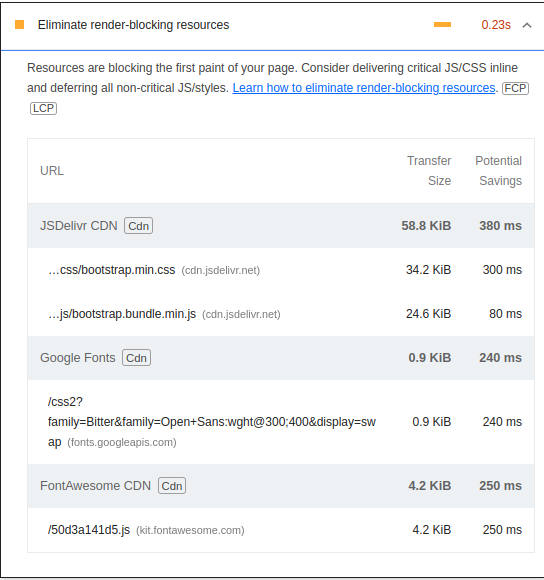

</details>

<details>

<summary>Issues affecting Best Practices</summary>

Lighthouse gives only a score of 92 for Best Practices for almost all the pages, but this is a problem beyond my scope at the moment.

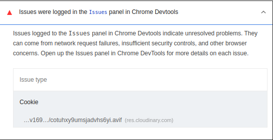

</details>

#### Home page 

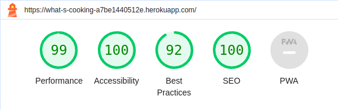

#### Recipes list page

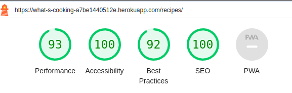

#### Recipe Detail page

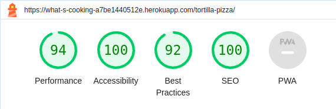

#### Add a Recipe page | Update a Recipe page

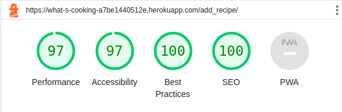


<details>

<summary>Why is Accessibility not 100?</summary>

The element is provided by Summernote, and it is not something I can change.

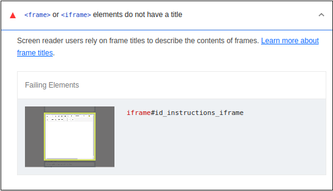

</details>

#### Category page

- There are some recipes within the selected category:

  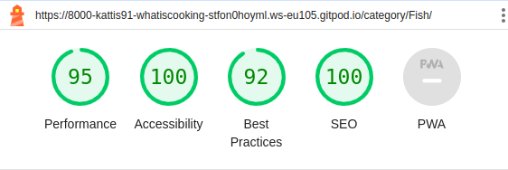

- There are NO recipes within the selected category:

  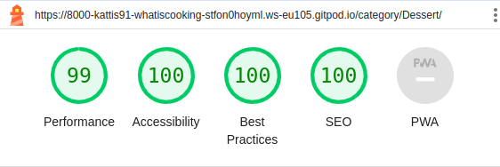

#### Sign Up

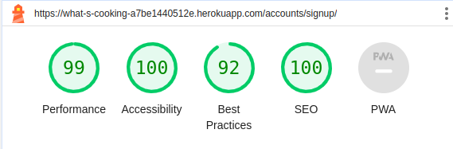

#### Login 

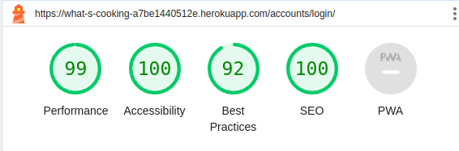

#### Logout

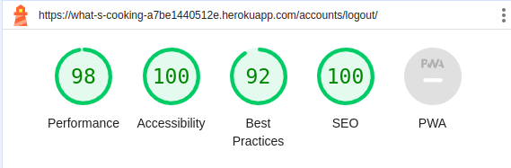


## Fixed Bugs

  - Static files were not loading in the deployed Heroku app. The local preview looked just the way it should, but checking the deployed site, none of the styling was there, and the images weren't loading.
    - **Fix**: Install [Whitenoise](https://whitenoise.readthedocs.io/en/latest/index.html) and put some lines of code in settings.py as mentioned in the link.

  - Chosen colors (`#71777ce6, whitesmoke and #ffc107`) didn't have sufficient contrast ratio. 
    - **Fix**: Use [Color Contrast Analyzer](https://dequeuniversity.com/rules/axe/4.7/color-contrast) provided by Lighthouse testing to find new colors working good together (see more in the Design section).

  - "Add a Recipe" form.
    
    - When filling out the form, users were presented with a drop-down menu that allowed them to select an author for their recipe. The menu displayed the usernames of every registered user on the website. However, despite the selection made by the user, the recipe was still published under their own name. This bug caused confusion, leading to a poorer user experience.
      - **Fix**: Delete the "author" field from the RecipeForm. The recipe is still published in the user's name without causing any issues or confusion for the user.
    
    - The recipe image failed to display. The default image appeared instead whenever a recipe was published.
      - **Fix**: It turned out that the enctype attribute was missed. I added *enctype="multipart/form-data"* to be able to upload images.

    - The slug wouldn't generate for the recipes submitted via the form.
      - **Fix**: Import slugify and include the helper method into the Recipe model.

        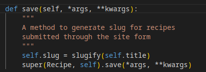

    - It was possible to choose zero and enter very large numbers into the estimated_time and servings fields.
      
      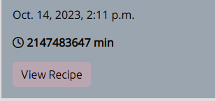
      
      - **Fix**: Add validate_nonzero function. Import and add MaxValueValidator.
        
        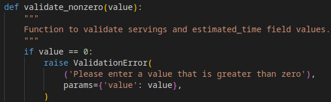

    - The layout of the recipe detail page was affected when a user entered a single long word. For example, the one long word typed in the Ingredients field overflowed into the Instructions field and continued beyond the right boundary of the page until the word was finished, causing the page's layout to break. 
      - **Fix**: 
        - Wrap the fields in the container. 
        - Use the word-wrap property with the value of break-word to be able to break the long words and wrap them onto the next line.
    
  - **Forbidden (403). CSRF verification failed. Request aborted.** message was displayed when I was trying to log in to the admin site in the beginning of the project.
    - **Fix**: `Add CSRF_TRUSTED_ORIGINS=['https://*.YOUR_DOMAIN.COM']` to settings.py


## Credits

### Media

- All the images used on the website are downloaded from [Unsplash](https://unsplash.com/).

- [Favicon Generator](https://favicon.io/favicon-converter/) was used to generate a favicon from the image.

- [Font Awesome](https://fontawesome.com/) was used to add the icons to the Logo and recipe detail page (estimated time, categories, servings, the number of likes, and the number of comments).

### Content

- The main code of this project is based on the Code Institute tutorial ["I Think Therefore I Blog"](https://github.com/Code-Institute-Solutions/Django3blog) with changes made to suit my project.

- I found Stack Overflow to be an excellent source of inspiration and a valuable channel for gaining knowledge. Things I learned and borrow from there:
 
  - Instructions on how to put different background images/background colors on different pages ([click here to read more](https://stackoverflow.com/questions/61434945/putting-a-different-background-image-on-a-different-page-in-a-website))

  - Instructions on how to make navbar links active depending on the page a user is viewing ([click here to read more](https://stackoverflow.com/questions/46617375/how-do-i-show-an-active-link-in-a-django-navigation-bar-dropdown-list))

  - Ability to create/update and delete recipes while getting a success message displayed is achieved by following instructions in two different Stack Overflow articles.
    - [Create/update](https://stackoverflow.com/questions/67366138/django-display-message-after-creating-a-post);
    - [Delete](https://stackoverflow.com/questions/47636968/django-messages-for-a-successfully-delete-add-or-edit-item).

  - A method to generate slug for recipes submitted through the site form ([click here to read more](https://stackoverflow.com/questions/837828/how-do-i-create-a-slug-in-django)).

  - PositiveIntegerFields (estimated_time and servings) were validated by following instructions in this [article](https://stackoverflow.com/questions/2248617/0-value-in-django-positiveintegerfield).

- The option to sort recipes by category was implemented following [Very Academy](https://www.youtube.com/watch?v=S9-Bt1JgRjQ&t=2137s) tutorial. I made some modifications in order to show my categories in the form of clickable "boxes" instead of displaying them in the navbar.

- The CSS code for category boxes to zoom/scale in on hover was borrowed from [W3Schools](https://www.w3schools.com/howto/howto_css_zoom_hover.asp).

- [Secret Key Generator](https://miniwebtool.com/django-secret-key-generator/) was used to generate Django Secret Key.


### Acknowledgements

I would like to aknowledge the following people:

  - Sean from the Tutor Assistance team for teaching me about the CSS word-wrap Property (used on the recipe detail page) and helping me to update timeout function for alert messages due to utilizing the newer version of Bootstrap.

  - My mentor Jubril for good briefings, feedback and tip.

  - Kay (the facilitator in my team) for always patiently answering all my questions during our Monday sessions &#128512;

  - Karolis_5P (Peer Code Review) who took time to look at my project, check the functionality and come up with valuable feedback.


## Deployment

### Installing Django and supporting libraries

- Install **Gunicorn**(the server that is used to run Django on Heroku): `pip3 install django gunicorn`

- Install **dj_database_url** and **pyscopg2**(connect to PostegreSQL): `pip 3 install dj_database_url pyscopg2`

- Install **Cloudinary** (The cloud platform used to store static media files): `pip3 install dj3-cloudinary-storage`

- Install **Whitenoise** (The library that allows the web app to serve its static files.): `pip3 install whitenoise`


### Create App

- Create Project.

- Create App.

- Add App to installed apps in **settings.py**:

  ````
  INSTALLED_APPS = [
    ...
    'APP_NAME',
  ]
  ````

### Create a new external database

- Navigate to **ElephantSQL.com** and click **“Get a managed database today”**.

- Click **Create New Instance**.

- Set up your plan:
  - give your plan a Name;
  - select the Tiny Turtle (Free) plan.

- Click **“Select Region”** and select a data center near you.

- Click **"Review"**, check that your details are correct and click **“Create instance”**.

- Return to the dashboard and click on the database instance name for this project.

- Copy the database URL.


### Create the Heroku app

 - Sign up for Heroku and accept terms of service.

 - Click the **"Create a new app"** button.

 - Give your app a name and select the region closest to you. A name must be unique.
  

### Create an env.py file

- Create **env.py** file and check that the file is included in the **.gitignore file**.

- Import os library: `import os`.

- Set environment variables:
  - **DATABASE_URL** with the value you just copied from ElephantSQL: `os.environ["DATABASE_URL"]="<copiedURL>`
  - **SECRET_KEY**: `os.environ["SECRET_KEY"] = "randomSecretKey"` ([Secret Key Generator](https://miniwebtool.com/django-secret-key-generator/) was used to generate a secret key).


### Update settings.py

- Add the following code:

  ````
  import os
  import dj_database_url
  if os.path.isfile('env.py'):
      import env
  ````

- Remove the insecure secret key provided by Django. Change your SECRET_KEY variable to the following: `SECRET_KEY = os.environ.get('SECRET_KEY')`

- Comment out the original **DATABASES** variable and add the code below:

  ````
  DATABASES = {
      'default': dj_database_url.parse(os.environ.get("DATABASE_URL"))
  }
  ````

- Save all files and make migrations: `python3 manage.py migrate`


### Connecting Heroku to the database

- Go back to the Heroku dashboard and open the **Settings** tab:

- Create _Config Vars_:
  - KEY: **PORT** | VALUE: **8000**.
  - KEY: **SECRET_KEY** | VALUE: **randomSecretKey**(the value that is in env.py)
  - KEY: **DATABASE_URL** | VALUE: **ElephantSQL database url**(no quotation marks needed)
  - KEY: **DISABLE_COLLECTSTATIC** | VALUE: **1** (Temporary to be able to deploy the project as we do not have any static files yet)


### Get static and media files stored on Cloudinary

- Create a Cloudinary account (steps can be found in the [Code Institutes](https://learn.codeinstitute.net/courses/course-v1:CodeInstitute+FST101+2021_T1/courseware/b31493372e764469823578613d11036b/9236975633b64a12a61a00e0cca7c47d/?child=first) tutorial in LMS).

- Copy **API Environment Variable** in the Cloudinary dashboard.

- Go back to **env.py** and add a new environment vriable:
  - **CLOUDINARY_URL** with the value just copied from the dashboard ⇧(remove CLOUDINARY_URL in the beginning).

- HEROKU: Add a new _Config Var_ with the KEY **CLOUDINARY_URL**, and the same value(URL) as in the step above.

- **settings.py**:

  - Add Cloudinary Libraries to installed apps (the order is important):

    ````
    INSTALLED_APPS = [
      ...,
      'cloudinary_storage',
      'django.contrib.staticfiles',
      'cloudinary',
      ...,
    ]
    ````
  
  - Tell Django to use Cloudinary to store media and static files:
   
    ````
    STATICFILES_STORAGE = 'cloudinary_storage.storage.StaticHashedCloudinaryStorage'
    STATICFILES_DIRS = [os.path.join(BASE_DIR, 'static'), ]
    STATIC_ROOT = os.path.join(BASE_DIR, 'staticfiles')

    MEDIA_URL = '/media/'
    DEFAULT_FILE_STORAGE = 'cloudinary_storage.storage.MediaCloudinaryStorage'
    ````
 
### Tell Django where templates will be stored

  - Link file to the templates directory in Heroku. _Place under the BASE_DIR line_:

    `TEMPLATES_DIR = os.path.join(BASE_DIR, 'templates')`

  - Change the templates directory to TEMPLATES_DIR:

    ````
    TEMPLATES = [
    {
      ...,
      'DIRS': [TEMPLATES_DIR],
      ...,
          ],
        },
      },
    ]
    ````

### Add Heroku Hostname to ALLOWED_HOSTS

  ````
  ALLOWED_HOSTS = ['app-name.herokuapp.com', 'localhost']
  ````

### Create a Procfile

`web: gunicorn whatscooking.wsgi`


### Go back to Heroku

- Click on the **"Deploy"** section on the top of the page.

- Select **GitHub** as deployment method and click the **"Connect to GitHub"** button.

- Search for the repository for this project, _what-is-cooking_. 

- Click **"Connect"** to link up Heroku app to the GitHub repository.

- Click on **"Deploy Branch"**.

- Click the **"Enable Automatic Deploys"** button to make it possible for Heroku to rebuild the app a new change is pushed to GitHub repository.


## Development 

## Fork

- Log in to **GitHub** and ind the repository for this project, [_Kattis91/what-is-cooking_](https://github.com/Kattis91/what-is-cooking).

- In the top-right corner of the page, click **Fork**.

- Type some new name into the "Repository name" field to distinguish your fork from the upstream repository.

- Click **Create Fork**.

- The fork is now in your personal account and can be changed in the way you want.

## Clone

- On **GitHub**, navigate to your fork of the _what-is-cooking_ repository.

- Above the list of files, click **<>Code**.

- Copy the **URL** for the repository. Repository can be cloned in three different ways:
  - **HTTPS**;
  - **SSH**;
  - **GitHub CLI**.

- Open Terminal and change the current working directory to the location where you want the cloned directory.

- Type `git clone`, and paste the URL you copied earlier. Press **Enter**


