# What's Cooking?

"What's Cooking?" is a public online blog-style platform where users can find recipes shared by food-loving people from around the globe. If someone wants to share their recipe or be able to comment and like others', they can register and log in. 

This interactive platform is designed to be an inspiration for those days when you don't know what to cook or simply want to try something new.

## Database Diagram

The database model diagram was designed using [Lucidchart]("https://www.lucidchart.com/pages/sv"). The first draft of the entity relationship diagram is nearly the same as the models used in the final database. However, during the project, my modules underwent changes that can be divided in three stages: planning, middle, and the final result.

### Planning

At this stage, the ingredients field is missing.

### Middle Stage

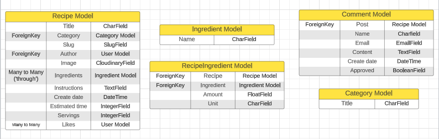

Here I got instructions and inspiration from [Stack Overflow]("https://stackoverflow.com/questions/61618882/best-way-to-organize-models-for-django-recipe-app-with-ingredients-recipes-and").

The idea was to use a Recipe model to create new recipes, an Ingredient model to include all the ingredients (that could be used in different recipes), and a RecipeIngredient model to establish a connection between the specific recipe and ingredients needed for that recipe. 

When I tried to retrieve ingredients from a user form on the site, I encountered issues, even though it worked well on the admin site. After reaching out to Tutor Assistance and trying to find a solution on Stack Overflow, Slack, and other platforms, I decided to proceed to step 3.

### Final Result

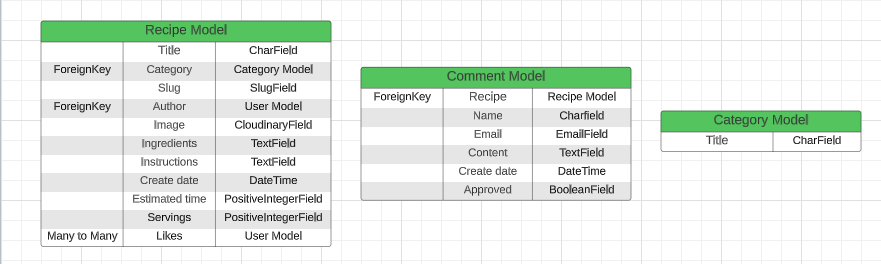

#### Recipe Model
  - The main model that contains all the fields needed for the recipe to be complete. Of course you can add other fields (like cooking time, difficulty level, nutritional value, and so on), but that values are not vital for the site to work and can be added later.
  - Is based on the "I think therefore I blog" walkthrough project. Some adjustments and additions were made to fit the needs of my project.

#### Comment Model
  - Enable logged-in users to add comments to different recipes.
  - Is based on the "I think therefore I blog" walkthrough project.

#### Category Model
  - The custom model.
  - Enable users to place recipes in different categories.
  - Make it possible to "sort" recipes by categories.

## Design

### Colour Scheme

The choice of colors depends on the background image chosen for home, sign up, login, and logout pages.

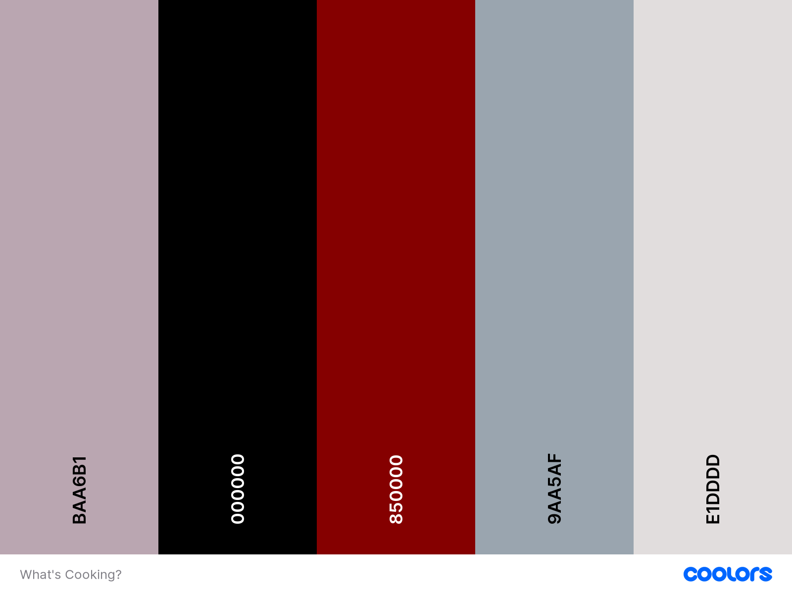

 - **9AA5AF** is the primary color used throughout the pages:
   - Welcome message.
   - Category boxes on the home page.
   - Recipe cards.
   - Add | Edit recipe forms.
   - Sign Up | Login | Logout forms.
   - Confirmation message when choosing to delete a recipe.
  
 - **BAA6B1** is used to style the navbar, the footer and the "View Recipe" button.

 - **000000** is the primary text color used throughout the pages.

 - **850000** is used for links and hover styling on navbar and footer. The color was chosen with the help of [Color Contrast Analyzer](https://dequeuniversity.com/rules/axe/4.7/color-contrast) (provided by Lighthouse testing) in order for background and foreground colors to have a sufficient contrast ratio.

 - **E1DDDD** is used as the background color for all recipe-related pages including recipes, recipe details, add recipe, edit recipe and categories.

## Features

### Navigation Bar

- The navigation bar is complete and responsive. It appears consistently on every page, making navigation more convenient.

- This section facilitates seamless navigation between pages, eliminating the need to rely on the "back button".

- Clicking on the Logo and "Home" will always redirect the user to the home page.

- When the user clicks on "Recipes", they will be directed to a page containing all available recipes,

- Logo and links to the home and recipes pages are **available for all users**. However, there are some differences in how the navigation bar looks for non-logged and logged-in users.
 
  - **Non-logged users:**

    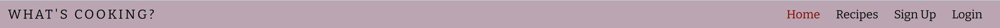
    
    - The navigation bar contains links for the Logo, Home, Recipes, Sign Up, and Login pages.
    - Clicking "Sign Up" or "Login" directs users to the pages with respective forms.

  - **Logged-in users:**
    
    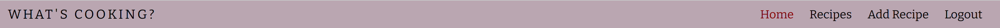

    - The navigation bar contains links for the Logo, Home, Recipes, Add Recipe, and Logout pages.
    - Clicking "Add Recipe" takes the user to a page where they can fill in a form to publish a recipe.
    - Clicking "Logout" directs users to the confirmation page.

### Welcome message

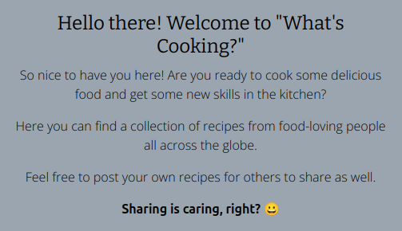

- This section welcomes users to the blog.

- Tells users that:
  - It is a recipe blog.
  - It is possible to publish own recipes.

### Categories

- This section shows all the categories available right now.

- Clicking on a category redirects the user to all recipes within that category. The "BACK" button takes the user back to the homepage.
  
  - There are some recipes available:
    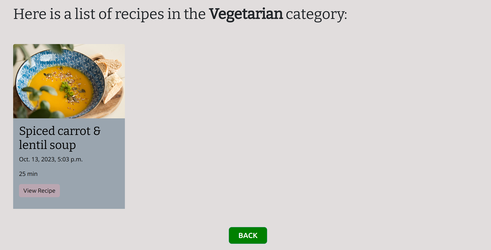

  - No recipes are available within the selected category.
     
    - Logged-in users:
      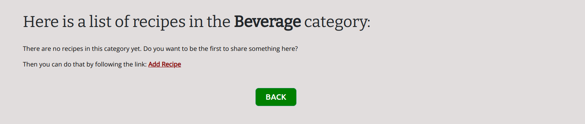

    - Unlogged users:
      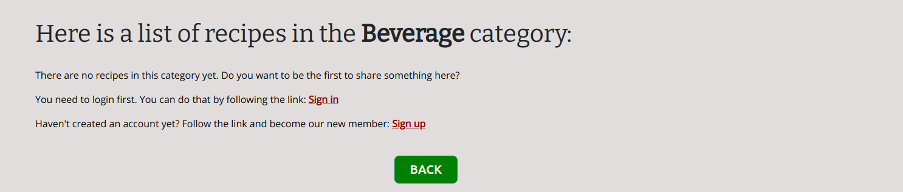

### Footer

- This section contains links to the appropriate social media platforms. By clicking on them, they will open in a new tab.

- The footer remains consistent across all pages.

### Sign Up

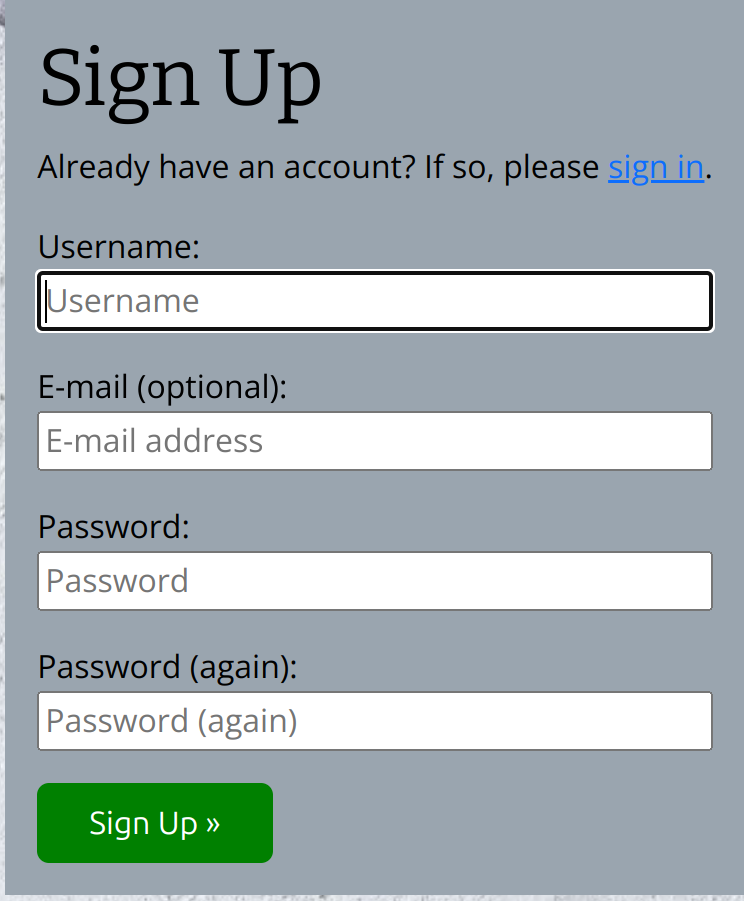

- The form enables users to register and create an account.

- The form includes following fields:
  - Username
  - Email
  - Password
  - Password (again)

- Email field is optional.

### Login

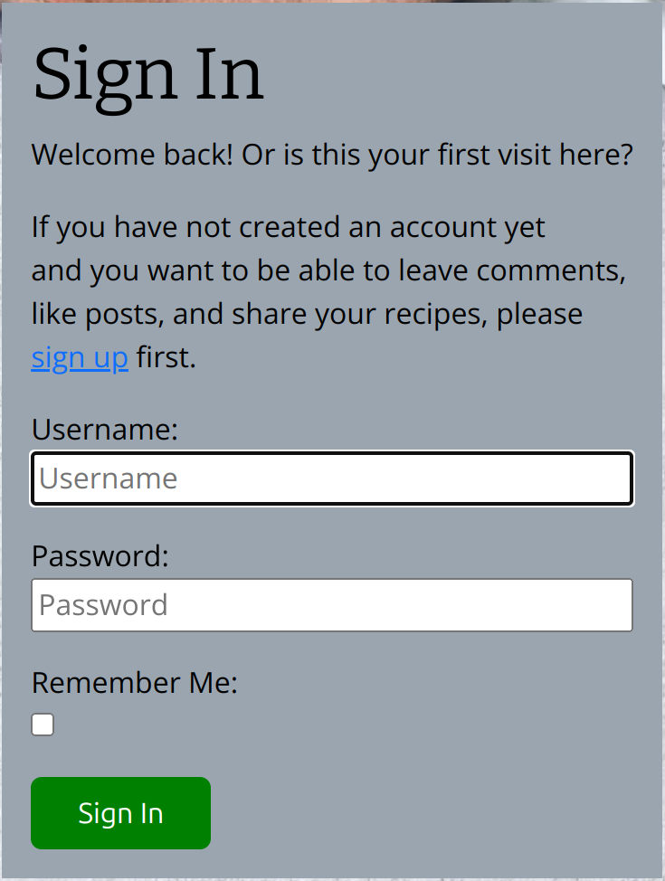

- The form enables users to log in.

- When a user logs in, they gain the ability to:
  - comment on existing recipes,
  - create new recipes.
  - edit/delete their own recipes.

- A message indicating that the operation was successful is shown on the screen.

### Logout

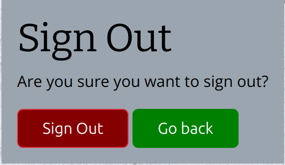

- When the user clicks on Logout in the navbar, they are redirected to a page displaying a confirmation message above.

  - Sign Out:
    - The user redirects to the home page.
    - A message indicating that the operation was successful is shown on the screen.

  - Go Back:
    - The user redirects to the home page.

### Recipes page

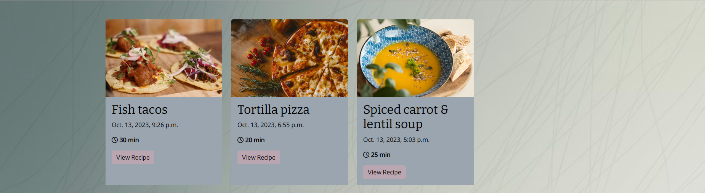

- This page shows a list of all the published recipes.

- Information displayed:
  - recipe image;
  - recipe title;
  - create date;
  - estimated time of cooking;
  - "View Recipe" button.

- By clicking on each recipe, the user redirects to a page containing detailed information about that specific recipe.

### Recipe detail page

The recipe detail page includes the following information:

  - The recipe image (or the default image if the recipe image doesn't load).
  
  - Information field containing some extra information for recipe authors.
    
    - Available for all users:
    
      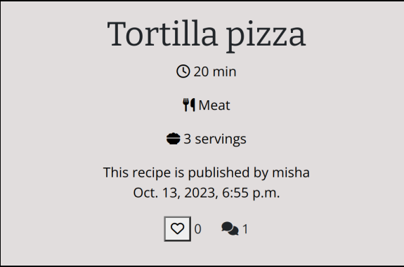

      - recipe title;
      - estimated time of cooking;
      - category;
      - number of servings;
      - recipe author;
      - create date;
      - likes icon:
        - logged-in users can like recipes;
        - no-logged users can only see the number of likes.
      - comment icon that shows the number of comments on the selected recipe.
    
    - Extra functionality for the recipe authors:
   
      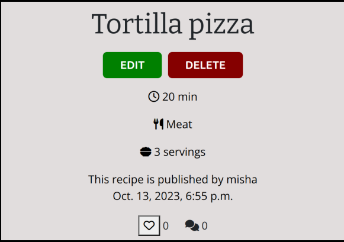

      - EDIT
        - By clicking the "EDIT" button, the user is redirected to the page with a form where they can edit the recipe posted by them.
      - DELETE
        - By clicking the "DELETE" button, the user is redirected to the page where they get a question about whether they are sure that they want to delete the recipe.

  - Ingredients section.

  - Instructions section.

  - Comments section:
    
    - There are some comments left:

      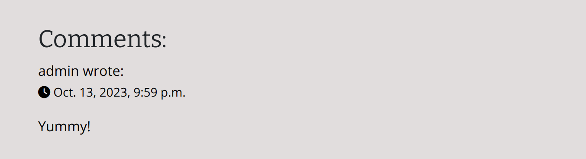
    
    - There are NO comments left:

      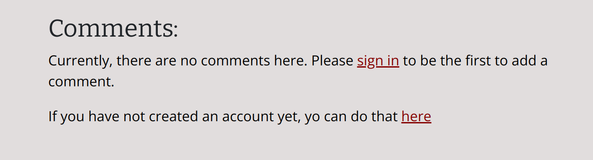

    - Leave a comment (available ONLY for logged-in users):

      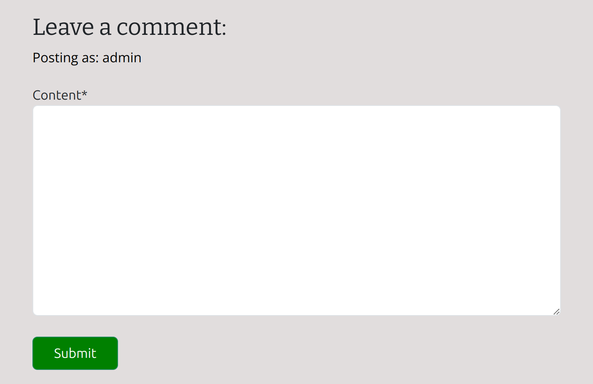

### Add a Recipe page

- This page includes a form that allows users who are logged in to publish their own recipes.

- Available fields:
  - Title
  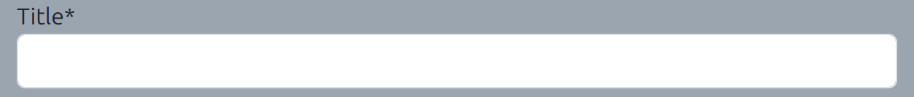
  - Category (Dropdown menu)
  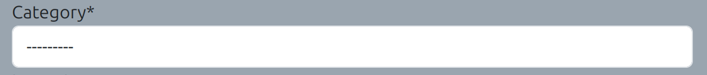
  - Image
  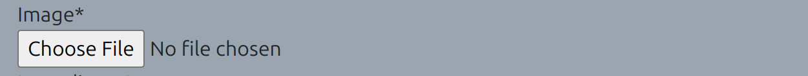
  - Ingredients
  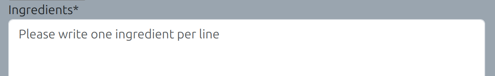
  - Instructions (Summernote field)
  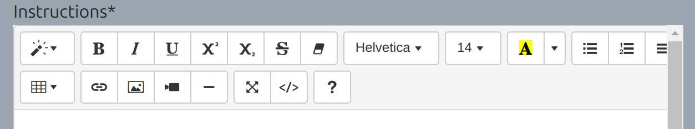
  - Estimated time
  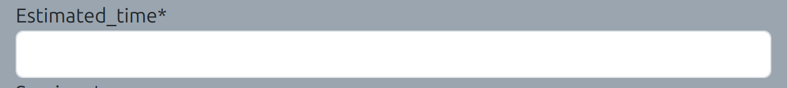
  - Servings
  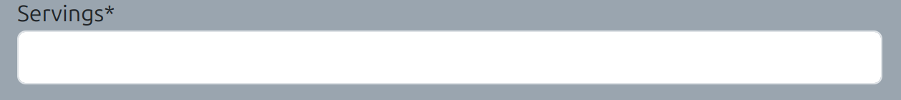
  
- "Save" button

  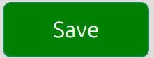

  - After correctly submitting the form, the user will be redirected to the recipes page upon clicking the save button.

  - A success message is displayed to the user.

- "Go back" button

  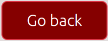

  - When the user clicks on the 'go back' button, they will be redirected to the recipes page.

## Testing

### Manual Testing

#### Navigation bar and footer (base.html)

| Feature | Expect | Action | Result | Pass/Fail |
|---------|--------|--------|--------|-----------|
| Navigation Bar. **Logo** (available for all users) | When the user clicks "WHAT'S COOKING?", they should be redirected to the homepage of the site. | Click on "WHAT'S COOKING?" in the navigation bar at the left top of the page. | The user is redirected to the home page of the site. | Pass |
| Navigation Bar. **Home** (available for all users) | When the user clicks "Home", they should be redirected to the homepage of the site. | Click on Home in the navigation bar at the top of the page. | The user is redirected to the home page of the site. | Pass |
| Navigation Bar. **Recipes** (available for all users) | When the user clicks "Recipes", they should be redirected to the recipes page of the site. | Click on Recipes in the navigation bar at the top of the page. | The user is redirected to the recipes page of the site. | Pass |
| Navigation Bar. **Sign Up** (available for all users) | When the user clicks "Sign Up" they should be redirected to the registration page. | Click on Sign Up in the navigation bar at the top of the page | The user is redirected to the registration page. | Pass |
| Navigation Bar. **Login** (available for all users) | When the user clicks "Sign In" they should be redirected to the sign in page. | Click on Sign In in the navigation bar at the top of the page. | The user is redirected to the sign in page. | Pass |
| Navigation Bar. **Add Recipe** (available for only logged-in users) | When the user clicks "Add Recipe", they should be redirected to a form page to submit their recipe. | Click on Add Recipe in the navigation bar at the top of the page. | The user is redirected to the form page. | Pass |
| Navigation Bar. **Logout** (available for only logged-in users) | When the user clicks "Logout", they should be redirected to a confirmation page before signing out. | Click on Logout in the navigation bar at the top of the page. | The user is redirected to the sign out confirmation page. | Pass |
| Link to Facebook (icon)| When clicked, links to a Facebook page in a new tab. | Click on the Facebook icon in the footer of the page. | Facebook page opens in a new tab. | Pass |
| Link to Instagram (icon) | When clicked, links to an Instagram page in a new tab.| Click on the Instagram icon in the footer of the page. | Instagram page opens in a new tab. | Pass |
| Link to TikTok (icon) | When clicked, links to a Tiktok page in a new tab. | Click on the TikTok icon in the footer of the page. | TikTok page opens in a new tab. | Pass |
| Link to YouTube (icon) | When clicked, links to a YoutTube page in a new tab.| Click on the Youtube icon in the footer of the page. | YouTube page opens in a new tab. | Pass |

#### Home page

| Feature | Expect | Action | Result | Pass/Fail |
|---------|--------|--------|--------|-----------|
| Categories | Each category box should be clickable. When the user clicks on a category, they should be directed to a page containing recipes only from that category. | Click on a category on the home page. | The user is directed to the page with the recipes within the chosen category. | Pass |
| Categories. No recipes. Logged-in users | If there are categories with no recipes yet, the user should get a clear message about that, along with the link to the "Add recipe" page. | Click on a category on the home page. | The user is directed to the page with the recipes within the chosen category. If there are no recipes available in the selected category, the user can see a message that reads "There are no recipes in this category yet. Do you want to be the first to share something here?" The message stating "Then you can do that by following the link: Add Recipe" is also displayed on the page. | Pass |
| Categories. No recipes. Unlogged users | If there are categories with no recipes yet, the user should get a clear message about that, along with the information that the user must be logged in to be able to post a recipe. | Click on a category on the home page. | The user is directed to the page with the recipes within the chosen category. If there are no recipes available in the selected category, the user can see a message that reads "There are no recipes in this category yet. Do you want to be the first to share something here?" Messages stating "You need to login first. You can do that by following the link: Sign In" and "Haven't created an account yet? Follow the link and become our new member: Sign Up" are also displayed on the page. | Pass |
| Categories. The "BACK" buton" | When the user is on the page with the recipes of the selected category, they should be able to click the "BACK" button to return to the home page of the site. | Click the "BACK" button on the page with the recipes of the selected category. | The user is directed to the home page of the site. | Pass |

#### Recipes list page

| Feature | Expect | Action | Result | Pass/Fail |
|---------|--------|--------|--------|-----------|
| Pagination | Each page should display a maximum of 8 recipes. Every ninth recipe should start on a new page. If there are more than eight recipes, "NEXT" (if there is a next page) and "PREV" (if there is a previous page) buttons should be displayed on the bottom of the page. | Add more than eight recipes to the blog. | Only eight recipes are displayed on the first page. The screen displays a "Next" button, which, when clicked, leads the user to a page with more recipes and a "Previous" button. | Pass |
| Clicking on recipe | Each recipe should be clickable. When the user clicks on a recipe, they should be directed to a page containing detailed information about that recipe. | Click on the "View recipe" button. | The user is directed to a page displaying detailed information about the selected recipe. | Pass |

#### Recipe detail page

| Feature | Expect | Action | Result | Pass/Fail |
|---------|--------|--------|--------|-----------|
| Information visible for all the users | Each recipe should display the image, preparation time, category, servings, author, creation date, and number of likes and comments. Ingredients, instructions, and comments should also be shown. | If you are currently logged in, make sure to log out. Go to the recipes page and click on the "View Recipe" button associated with the recipe that you want to view. | The image, preparation time, category, servings, author, creation date, number of likes and comments, ingredients, instructions, and comments are all displayed on the page. | Pass |
| No comments | If there are no comments on the recipe, the user should see a message saying that. | Find a recipe with zero comments. | The "Currently, there are no comments here. Please sign in to be the first to add a comment. If you have not created an account yet, you can do that here" message is displayed in the comments section. | Pass |
| Likes possibility for logged-in users | All logged-in users should be able to like/unlike all published recipes. The number of likes should increase when liking and decrease when pressing again. | Log in, go to the recipes page and click on the "View Recipe" button associated with the recipe that you want to view. Click on like button to like the recipe, click one more time to unlike.| The number of likes increase when liking and decrease when clicking like icon one more time. | Pass |
| Comment possibility for logged-in users | All logged-in users should be able to comment all published recipes. A message saying "Your comment is awaiting approval..." should be displayed on the screen. | Log in, go to the recipes page and click on the "View Recipe" button associated with the recipe that you want to view. Write a comment and click "Submit". | "Your comment is awaiting approval..." message appears on the screen. | Pass |
| Edit posibility for recipe authors | Recipe authors should be able to edit their recipes by updating the prepopulated form accessed through the "EDIT" button located under the recipe title. | Log in and publish a recipe. Click on the newly published recipe, then click "EDIT" to update and "SAVE". | The updated version of the recipe is published on the blog. | Pass |
| Delete posibility for recipe authors | Recipe authors should be able to delete their recipes by clicking the "DELETE" button located under the recipe title. The user should be redirected to a confirmation page where they are asked whether they are sure they want to delete the recipe or not. | Log in and publish a recipe. Click on the newly published recipe, then click "DELETE" button and "DELETE RECIPE" button on the confirmation page. | The recipe is successfully deleted. | Pass |

#### Add a Recipe Page (Available for logged-in users only)
| Feature | Expect | Action | Result | Pass/Fail |
|---------|--------|--------|--------|-----------|
| Incomplete form | It shouldn't be possible to submit the form without first filling in all the fields. | Leave one or several fields empty and click the "Save" button. | The user remains on the "Add recipe page" until all the fields are filled in. | Pass |
| Estimated_time validation (greater than 0) | When trying to choose zero in the "estimated_time" field, the user should get a message saying "Please enter a value that is greater than zero". | Fill in the form and enter "0" into the "estimated_time" field. | "Please enter a value that is greater than zero" message appears below the field. | Pass |
| Servings validation (greater than 0) | When trying to choose zero in the "servings" field, the user should get a message saying "Please enter a value that is greater than zero". | Fill in the form and enter "0" into the "servings" field. | "Please enter a value that is greater than zero" message appears below the field. | Pass |
| Estimated_time validation (is less or equal to 600) | When trying to enter a value greater than 600 (min) into the "estimated_time" field, the user should get a message saying "Ensure this value is less than or equal to 600". | Fill in the form and enter a value greater than 600 into the "estimated_time" field. | "Ensure this value is less than or equal to 600" message appears below the field. | Pass |
| Servings validation (is less or equal to 50) | When trying to enter a value greater than 50 into the "servings" field, the user should get a message saying "Ensure this value is less than or equal to 50". | Fill in the form and enter some value greater than 50 into the "servings" field. | "Ensure this value is less than or equal to 50" message appears below the field. | Pass |
| Form submission | After successfully submitting the form, the user should be taken to the page displaying all published recipes. The newly published recipe should be shown in the top left corner. | Fill successfully in all the fields and click the "Save" button. | The user is redirected to the Recipes page. The newly published recipe is displayed as the first recipe on the page. | Pass |
| "Cancel" | By clicking the "Cancel" button, the user should be taken to the Recipes page. | Click the "Cancel" button. | The user is redirected to the Recipes page. | Pass |

#### Sign Up
| Feature | Expect | Action | Result | Pass/Fail |
|---------|--------|--------|--------|-----------|
| Submit | After successfully submitting the sign up form, the user should be redirected to the homepage, where they can access links through the navigation menu available only for logged-in users. | Click on the "Sign Up" link in the navigation bar, fill in the form and click "Sign Up". | The user is directed to the homepage. "Home | Recipes | Sign Up | Login" links change to "Home | Recipes | Add Recipe | Logout". | Pass | 
| Submit without filling in the mandadory fields | When trying to submit the form without filling in mandatory fields, the user should get an ":exclamation: Please fill out this field" error message. | Click on the "Sign In" link in the navigation bar and then click the "Sign Up" button without filling in username, password or password(again) fields. | The ":exclamation: Please fill out this field" error message appears on the screen | Pass |

#### Login
| Feature | Expect | Action | Result | Pass/Fail |
|---------|--------|--------|--------|-----------|
| Sign In | After successfully filling in the sign in form, the user should be redirected to the homepage, where they can access links through the navigation menu available only for logged-in users. | Click on the "Login" link in the navigation bar, fill in the form, and click "Sign In". | The user is directed to the homepage. "Home | Recipes | Sign Up | Login" links change to "Home | Recipes | Add Recipe | Logout". | Pass | 
| Sign In without filling in the mandadory fields | When trying to submit the form without filling in mandatory fields, the user should get an ":exclamation: Please fill out this field" error message. | Click on the "Login" link in the navigation bar and then click the "Sign in" button without filling in username or password fields. | The ":exclamation: Please fill out this field" error message appears on the screen | Pass |

#### Logout
| Feature | Expect | Action | Result | Pass/Fail |
|---------|--------|--------|--------|-----------|
| Sign Out | By clicking on the Logout link, the user should be redirected to the confirmation page. | Click on the "Logout" link in the navigation bar. | The user is directed to the "Sign Out" page asking "Are you sure you want to sign out?". | Pass 
| "Are you sure you want to sign out?". **Sign Out** | Choosing to sign out, the user should be signed out and directed to the homepage, where they can access links through the navigation menu available for all users. | Click the "Sign Out" button. | The user is directed to the homepage. "Home | Recipes | Add Recipe | Logout" links change to "Home | Recipes | Sign Up | Login". | Pass |
| "Are you sure you want to sign out?". **Go Back** | Choosing to go back, the user should just be directed to the homepage. | Click the "Go back" button. | The user is directed to the homepage. The user is still logged in. | Pass |

## Technologies used

### Languages
 
  - HTML
  - CSS
  - Python
  - JavaScript

### Frameworks, Libraries and Programs

  - [Django](https://www.djangoproject.com/)
   
  - [Django-Allauth](https://docs.allauth.org/en/latest/)
    - used for User authenticaion (sign up, sign in and sign out features).

  - [Django Crispy Forms](https://django-crispy-forms.readthedocs.io/en/latest/)
    - used to control rendering behaviour of Django forms.

  - [Gunicorn](https://docs.djangoproject.com/en/4.2/howto/deployment/wsgi/gunicorn/)
    - Python HTTP server for WSGI applications.
  
  - [psycopg2](https://pypi.org/project/psycopg2/)
    - PostgreSQL database adapter for the Python programming language.
  
  - [Summernote](https://summernote.org/)
    - WYSIWYG editor. Used for ingredients and instruction fields on the Admin site and instructions field in the "Add a recipe" form.

  - [WhiteNoise](https://whitenoise.readthedocs.io/en/latest/index.html)
    - The library that allows the web app to serve its static files.

  - [ElepantSQL](https://www.elephantsql.com/)
    - The database used by the deployed project on Heroku.

  - [Cloudinary](https://cloudinary.com/)
    - The cloud platform used to store static media files.

  - [Git](https://git-scm.com/)
    - used for version controll.

  - [GitPod](https://www.gitpod.io/)
    - The IDE used to create the site.

  - [GitHub](https://github.com/)
    - The code hosting platform used to save and store the files for the website.

  - [Heroku](https://www.heroku.com/)
    - The cloud platform used to deploy the project into live environment.
  
  - [Lucidchart](https://www.lucidchart.com/pages/sv)
    - The diagramming application used to create ERD diagrams.

## Credits

### Content

- The main code of this project is based on the Code Institute tutorial ["I Think Therefore I Blog"](https://github.com/Code-Institute-Solutions/Django3blog) with changes made to suit my project.

- The option to sort recipes by category was implemented following [Very Academy](https://www.youtube.com/watch?v=S9-Bt1JgRjQ&t=2137s) tutorial. I made some modifications in order to show my categories in the form of clickable "boxes" instead of displaying them in the navbar.

- Instructions on how to put different background images/background colors on different pages were taken from [Stack Overflow](https://stackoverflow.com/questions/61434945/putting-a-different-background-image-on-a-different-page-in-a-website).

- [Stack Overflow](https://stackoverflow.com/questions/46617375/how-do-i-show-an-active-link-in-a-django-navigation-bar-dropdown-list) was even the source of instructions on how to make navbar links active depending on the page a user is viewing.

- The CSS code for category boxes to zoom/scale in on hover was borrowed from [W3Schools](https://www.w3schools.com/howto/howto_css_zoom_hover.asp).

- [Secret Key Generator](https://miniwebtool.com/django-secret-key-generator/) was used to generate Django Secret Key.

- Ability to create/update and delete recipes while getting a success message displayed is achieved by following instructions in two different Stack Overflow articles.
  - [Create/update](https://stackoverflow.com/questions/67366138/django-display-message-after-creating-a-post);
  - [Delete](https://stackoverflow.com/questions/47636968/django-messages-for-a-successfully-delete-add-or-edit-item).

- PositiveIntegerFields (estimated_time and servings) were validated by following instructions in this [Stack Overflow](https://stackoverflow.com/questions/2248617/0-value-in-django-positiveintegerfield) article.

- Thanks to Sean from the Tutor Assistance team for teaching me about the CSS word-wrap Property (used on the recipe detail page) and helping me to update timeout function for alert messages due to utilizing the newer version of Bootstrap.

