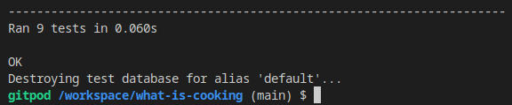
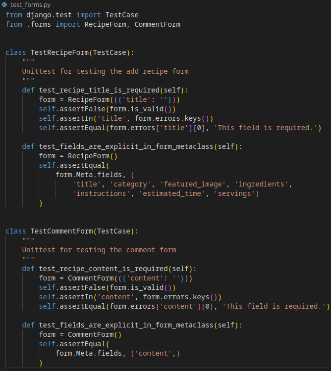
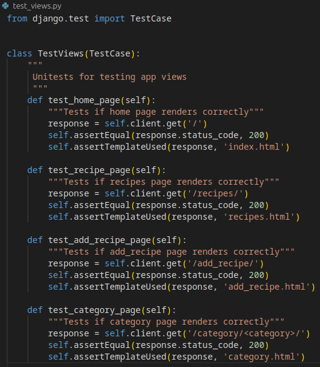
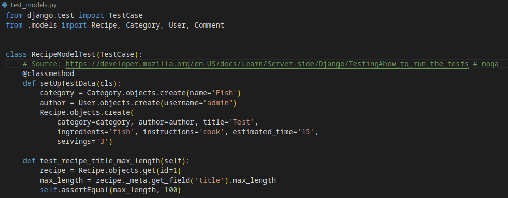

# What's Cooking testing

:back: [Go back to README](README.md)

## Table of contents

- [Validator Testing](#validator-testing)
  - [HTML](#html)
  - [CSS](#css)
  - [JavaScript](#javascript)
  - [Python](#python)

- [Responsivness & Browser Compability Testing](#responsivness--browser-compability-testing)

- [Manual Testing](#manual-testing)

- [Automated Testing](#automated-testing)
  - [Testing forms](#testing-forms)
  - [Testing views](#testing-views)
  - [Testing models](#testing-models)

- [Testing of User Stories](#testing-of-user-stories)
  - [EPIC: Authentication](#epic-authentication)
  - [EPIC: CRUD functionality](#epic-crud-functionality)
  - [EPIC: Administration](#epic-administration)
  - [Must_haves](#must_haves)
  - [Should_haves](#should_haves)
  - [Could_haves](#could_haves)

- [Lighthouse Testing](#lighthouse)

## Validator Testing

### HTML

Validator: [W3C Validator](https://validator.w3.org/).
  
- **Home Page**

  

- **Sign Up**

  

- **Login**

  

- **Logout**

  

- **Recipes Page**

  

- **Recipe detail page**

  

- **Category**
    
  

    No errors or warnings to show for either of these three cases:
    - There are recipes within the selected category.
    - There are no recipes within the selected category. The user is logged in.
    - There are no recipes within the selected category. The user is not logged in.

- **Add recipe page | Update Recipe page**

  All errors listed by W3Validator are related to Summernote, and not any code written by me. Errors are the same for both "Add Recipe" page and "Update Recipe" page. Research conducted within the Code Institute community indicates that this is a common occurrence, and therefore it should be noted. However, no action needs to be taken in response.

  <details>

  <summary>Click here to see the errors.</summary>
    
    

  </details>

- **Delete recipe page**

  

- **404.html**

  

### CSS

Validator: [Jigsaw Validator](https://jigsaw.w3.org/css-validator/validator).
  
  

### JavaScript 

Validator: [JSHint Validator](https://jshint.com/).
  - No errors were found when passing through the validator.
  - Validator gave warnings about one undefined variable(Bootstrap). No action is taken because this custom bootstrap variable does not need to be defined within the script.

    

### Python 

Validator: [CI Python Linter](https://pep8ci.herokuapp.com/).

Only files with custom-written Python code have been verified with the validator. All the files tested got the result below.


- **admin.py** 
  - All clear, no errors found.

- **models.py**
  - All clear, no errors found.

- **forms.py**
  - All clear, no errors found.

- **views.py**
  - All clear, no errors found.

- **whatscooking/urls.py**
  - All clear, no errors found.

- **blog/urls.py**
  - All clear, no errors found.

[Back to top ⇧](#table-of-contents)

## Responsivness & Browser Compability Testing

- In order to thoroughly test my website, I conducted a series of tests on various browsers including Google Chrome, Safari, and Mozilla Firefox.

- I also tested on multiple devices such as:
  - Laptop:
    - Dell xps 13.
  - Mobile Devices:
    - iPhone XS, 
    - iPhone 13 Pro, 
    - Samsung Galaxy S10.

- I made sure to check every page using Google Chrome developer tools to confirm their responsiveness on various screen sizes.

## Manual Testing

<details><summary>Navigation bar and footer (base.html)</summary>

| Feature | Expect | Action | Result | Pass/Fail |
|---------|--------|--------|--------|-----------|
| Navigation Bar. **Logo** (available for all users) | When the user clicks "WHAT'S COOKING?", they should be redirected to the homepage of the site. | Click on "WHAT'S COOKING?" in the navigation bar at the left top of the page. | The user is redirected to the home page of the site. | Pass |
| Navigation Bar. **Home** (available for all users) | When the user clicks "Home", they should be redirected to the homepage of the site. | Click on Home in the navigation bar at the top of the page. | The user is redirected to the home page of the site. | Pass |
| Navigation Bar. **Recipes** (available for all users) | When the user clicks "Recipes", they should be redirected to the recipes page of the site. | Click on Recipes in the navigation bar at the top of the page. | The user is redirected to the recipes page of the site. | Pass |
| Navigation Bar. **Sign Up** (available for all users) | When the user clicks "Sign Up" they should be redirected to the registration page. | Click on Sign Up in the navigation bar at the top of the page | The user is redirected to the registration page. | Pass |
| Navigation Bar. **Login** (available for all users) | When the user clicks "Sign In" they should be redirected to the sign in page. | Click on Sign In in the navigation bar at the top of the page. | The user is redirected to the sign in page. | Pass |
| Navigation Bar. **Add Recipe** (available for only logged-in users) | When the user clicks "Add Recipe", they should be redirected to a form page to submit their recipe. | Click on Add Recipe in the navigation bar at the top of the page. | The user is redirected to the form page. | Pass |
| Navigation Bar. **Logout** (available for only logged-in users) | When the user clicks "Logout", they should be redirected to a confirmation page before signing out. | Click on Logout in the navigation bar at the top of the page. | The user is redirected to the sign out confirmation page. | Pass |
| Link to Facebook (icon)| When clicked, links to a Facebook page in a new tab. | Click on the Facebook icon in the footer of the page. | Facebook page opens in a new tab. | Pass |
| Link to Instagram (icon) | When clicked, links to an Instagram page in a new tab.| Click on the Instagram icon in the footer of the page. | Instagram page opens in a new tab. | Pass |
| Link to TikTok (icon) | When clicked, links to a Tiktok page in a new tab. | Click on the TikTok icon in the footer of the page. | TikTok page opens in a new tab. | Pass |
| Link to YouTube (icon) | When clicked, links to a YoutTube page in a new tab.| Click on the Youtube icon in the footer of the page. | YouTube page opens in a new tab. | Pass |
</details>

<details> 
<summary>Success messages (feedback to the user)</summary>

*All the messages automatically disappear after 3 seconds.

| Feature | Expect | Action | Result |
|---------|--------|--------|--------|
| Sign Up / Login | When a user successfully signs up, a message indicating success should appear and disappear automatically*. | Click the Sign Up link in the navbar. |  |
| Login | When a user successfully logs in, a message indicating success should appear and disappear automatically*. | Click the Login link in the navbar. |  | 
| Logout | When a user successfully logs out, a message indicating success should appear and disappear automatically*. | Click the Logout link in the navbar. |  | 
| Posting a recipe | When a user successfully posts a recipe, a message indicating success should appear and disappear automatically*. | Go to the "Add Recipe" page, fill out each field accurately, and press "SAVE". |  | 
| Updating a recipe | When a user successfully updates a recipe, a message indicating success should appear and disappear automatically*. | Go to one of the recipes posted by you, click the "EDIT" button, make some changes and press "UPDATE". |  |
| Deleting a recipe | When a user successfully deletes a recipe, a message indicating success should appear and disappear automatically*. | Go to one of the recipes posted by you, click the "DELETE" button, and then "DELETE RECIPE" when being asked if you are sure. |  | 
</details>

<details> 
<summary>Home page</summary>

| Feature | Expect | Action | Result | Pass/Fail |
|---------|--------|--------|--------|-----------|
| Categories | Each category box should be clickable. When the user clicks on a category, they should be directed to a page containing recipes only from that category. | Click on a category on the home page. | The user is directed to the page with the recipes within the chosen category. | Pass |
| Categories. No recipes. Logged-in users | If there are categories with no recipes yet, the user should get a clear message about that, along with the link to the "Add recipe" page. | Click on a category on the home page. | The user is directed to the page with the recipes within the chosen category. If there are no recipes available in the selected category, the user can see a message that reads "There are no recipes in this category yet. Do you want to be the first to share something here?" The message stating "Then you can do that by following the link: Add Recipe" is also displayed on the page. | Pass |
| Categories. No recipes. Unlogged users | If there are categories with no recipes yet, the user should get a clear message about that, along with the information that the user must be logged in to be able to post a recipe. | Click on a category on the home page. | The user is directed to the page with the recipes within the chosen category. If there are no recipes available in the selected category, the user can see a message that reads "There are no recipes in this category yet. Do you want to be the first to share something here?" Messages stating "You need to login first. You can do that by following the link: Sign In" and "Haven't created an account yet? Follow the link and become our new member: Sign Up" are also displayed on the page. | Pass |
| Categories. The "BACK" buton" | When the user is on the page with the recipes of the selected category, they should be able to click the "BACK" button to return to the home page of the site. | Click the "BACK" button on the page with the recipes of the selected category. | The user is directed to the home page of the site. | Pass |
</details>

<details> 
<summary>Recipes list page</summary>

| Feature | Expect | Action | Result | Pass/Fail |
|---------|--------|--------|--------|-----------|
| Pagination | Each page should display a maximum of 8 recipes. Every ninth recipe should start on a new page. If there are more than eight recipes, "NEXT" (if there is a next page) and "PREV" (if there is a previous page) buttons should be displayed on the bottom of the page. | Add more than eight recipes to the blog. | Only eight recipes are displayed on the first page. The screen displays a "Next" button, which, when clicked, leads the user to a page with more recipes and a "Previous" button. | Pass |
| Clicking on recipe | Each recipe should be clickable. When the user clicks on a recipe, they should be directed to a page containing detailed information about that recipe. | Click on the "View recipe" button. | The user is directed to a page displaying detailed information about the selected recipe. | Pass |
</details>

<details> 
<summary>Recipe detail page</summary>

| Feature | Expect | Action | Result | Pass/Fail |
|---------|--------|--------|--------|-----------|
| Information visible for all the users | Each recipe should display the image, preparation time, category, servings, author, creation date, and number of likes and comments. Ingredients, instructions, and comments should also be shown. | If you are currently logged in, make sure to log out. Go to the recipes page and click on the "View Recipe" button associated with the recipe that you want to view. | The image, preparation time, category, servings, author, creation date, number of likes and comments, ingredients, instructions, and comments are all displayed on the page. | Pass |
| No comments | If there are no comments on the recipe, the user should see a message saying that. | Find a recipe with zero comments. | The "Currently, there are no comments here. Please sign in to be the first to add a comment. If you have not created an account yet, you can do that here" message is displayed in the comments section. | Pass |
| Likes possibility for logged-in users | All logged-in users should be able to like/unlike all published recipes. The number of likes should increase when liking and decrease when pressing again. | Log in, go to the recipes page and click on the "View Recipe" button associated with the recipe that you want to view. Click on like button to like the recipe, click one more time to unlike.| The number of likes increase when liking and decrease when clicking like icon one more time. | Pass |
| Comment possibility for logged-in users | All logged-in users should be able to comment all published recipes. A message saying "Your comment is awaiting approval..." should be displayed on the screen. | Log in, go to the recipes page and click on the "View Recipe" button associated with the recipe that you want to view. Write a comment and click "Submit". | "Your comment is awaiting approval..." message appears on the screen. | Pass |
| Edit posibility for recipe authors | Recipe authors should be able to edit their recipes by updating the prepopulated form accessed through the "EDIT" button located under the recipe title. | Log in and publish a recipe. Click on the newly published recipe, then click "EDIT" to update and "SAVE". | The updated version of the recipe is published on the blog. | Pass |
| EDIT -> CANCEL | Clicking the "CANCEL" button under the "Edit your Recipe" form, should take the user back to the detailed information about the recipe they wanted to update. | Click on your published recipe, then click "EDIT" and "CANCEL". | The user is redirected back to the detailed page. | Pass
| Delete posibility for recipe authors | Recipe authors should be able to delete their recipes by clicking the "DELETE" button located under the recipe title. The user should be redirected to a confirmation page where they are asked whether they are sure they want to delete the recipe or not. | Log in and publish a recipe. Click on the newly published recipe, then click "DELETE" button and "DELETE RECIPE" button on the confirmation page. | The recipe is successfully deleted. | Pass |
| DELETE -> GO BACK | Clicking the "GO BACK" button on the confirmation page, should take the user back to the detailed information about the recipe they wanted to delete. | Click on your published recipe, then click "DELETE" and then "GO BACK". | The user is redirected back to the detailed page. | Pass
</details>

<details> 
<summary> Add a Recipe Page (Available for logged-in users only)</summary>

| Feature | Expect | Action | Result | Pass/Fail |
|---------|--------|--------|--------|-----------|
| Incomplete form | It shouldn't be possible to submit the form without first filling in all the fields. | Leave one or several fields empty and click the "Save" button. | The user remains on the "Add recipe page" until all the fields are filled in. | Pass |
| Estimated_time validation (greater than 0) | When trying to choose zero in the "estimated_time" field, the user should get a message saying "Please enter a value that is greater than zero". | Fill in the form and enter "0" into the "estimated_time" field. | "Please enter a value that is greater than zero" message appears below the field. | Pass |
| Servings validation (greater than 0) | When trying to choose zero in the "servings" field, the user should get a message saying "Please enter a value that is greater than zero". | Fill in the form and enter "0" into the "servings" field. | "Please enter a value that is greater than zero" message appears below the field. | Pass |
| Estimated_time validation (is less or equal to 600) | When trying to enter a value greater than 600 (min) into the "estimated_time" field, the user should get a message saying "Ensure this value is less than or equal to 600". | Fill in the form and enter a value greater than 600 into the "estimated_time" field. | "Ensure this value is less than or equal to 600" message appears below the field. | Pass |
| Servings validation (is less or equal to 50) | When trying to enter a value greater than 50 into the "servings" field, the user should get a message saying "Ensure this value is less than or equal to 50". | Fill in the form and enter some value greater than 50 into the "servings" field. | "Ensure this value is less than or equal to 50" message appears below the field. | Pass |
| Form submission | After successfully submitting the form, the user should be taken to the page displaying all published recipes. The newly published recipe should be shown in the top left corner. | Fill successfully in all the fields and click the "Save" button. | The user is redirected to the Recipes page. The newly published recipe is displayed as the first recipe on the page. | Pass |
| "Cancel" | By clicking the "Cancel" button, the user should be taken to the Recipes page. | Click the "Cancel" button. | The user is redirected to the Recipes page. | Pass |
</details>

<details> 
<summary>Sign Up</summary>

| Feature | Expect | Action | Result | Pass/Fail |
|---------|--------|--------|--------|-----------|
| Submit | After successfully submitting the sign up form, the user should be redirected to the homepage, where they can access links through the navigation menu available only for logged-in users. | Click on the "Sign Up" link in the navigation bar, fill in the form and click "Sign Up". | The user is directed to the homepage. "Home / Recipes / Sign Up / Login" links change to "Home / Recipes / Add Recipe / Logout". | Pass | 
| Submit without filling in the mandadory fields | When trying to submit the form without filling in mandatory fields, the user should get an ":exclamation: Please fill out this field" error message. | Click on the "Sign In" link in the navigation bar and then click the "Sign Up" button without filling in username, password or password(again) fields. | The ":exclamation: Please fill out this field" error message appears on the screen | Pass |
</details>

<details> 
<summary>Login</summary>

| Feature | Expect | Action | Result | Pass/Fail |
|---------|--------|--------|--------|-----------|
| Sign In | After successfully filling in the sign in form, the user should be redirected to the homepage, where they can access links through the navigation menu available only for logged-in users. | Click on the "Login" link in the navigation bar, fill in the form, and click "Sign In". | The user is directed to the homepage. "Home / Recipes / Sign Up / Login" links change to "Home / Recipes / Add Recipe / Logout". | Pass | 
| Sign In without filling in the mandadory fields | When trying to submit the form without filling in mandatory fields, the user should get an ":exclamation: Please fill out this field" error message. | Click on the "Login" link in the navigation bar and then click the "Sign in" button without filling in username or password fields. | The ":exclamation: Please fill out this field" error message appears on the screen | Pass |
</details>

<details> 
<summary>Logout</summary>

| Feature | Expect | Action | Result | Pass/Fail |
|---------|--------|--------|--------|-----------|
| Sign Out | By clicking on the Logout link, the user should be redirected to the confirmation page. | Click on the "Logout" link in the navigation bar. | The user is directed to the "Sign Out" page asking "Are you sure you want to sign out?". | Pass 
| "Are you sure you want to sign out?". **Sign Out** | Choosing to sign out, the user should be signed out and directed to the homepage, where they can access links through the navigation menu available for all users. | Click the "Sign Out" button. | The user is directed to the homepage. "Home / Recipes / Add Recipe / Logout" links change to "Home / Recipes / Sign Up / Login". | Pass |
| "Are you sure you want to sign out?". **Remain logged in** | Choosing to remain logged in, the user should just be directed to the homepage. | Click the "Remain logged in" button. | The user is directed to the homepage. The user is still logged in. | Pass |
</details> 

[Back to top ⇧](#table-of-contents)

## Automated Testing

As part of the project, I conducted automated testing towards the end.

I have received guidance and instructions from the following sources:

- The "Hello Django" walkthrough project;

- This article: [Django Tutorial Part 10: Testing a Django web application](https://developer.mozilla.org/en-US/docs/Learn/Server-side/Django/Testing#how_to_run_the_tests).

To conduct testing, I added the following code ([source](https://stackoverflow.com/questions/47466185/got-an-error-creating-the-test-database-django-unittest)) to settings.py:

````
import sys
if 'test' in sys.argv or 'test_coverage' in sys.argv: 
    DATABASES['default']['ENGINE'] = 'django.db.backends.sqlite3'
````
**Result:**



### Testing forms

<details>

<summary>Click here to see more details</summary>



</details>

### Testing views

<details>

<summary>Click here to see more details</summary>



</details>

### Testing models

<details>

<summary>Click here to see more details</summary>



</details>

[Back to top ⇧](#table-of-contents)

## Testing of User Stories

- **I used Milestones to keep track on my EPICS**.

- Some of the "should-haves" and "could-haves" were completed before "must-haves" because that suited the workflow better. Despite this, I always kept track to ensure I didn't miss any of my "must-haves".

- I moved the "Choose between categories" User story from the "To Do" list to the "Doing" list twice. This was because I initially placed the category boxes on the homepage (no functionality here) before developing the view, adding a new URL, and creating the category.html page. It is still the same User story, but doing it the way I did made it easier for me to track my progress.

- One User story remains incomplete: "Sign in with Social Networks". This User story will not be done this time. This particular feature is not crucial or vital and can be postponed until the next opportunity. However, this functionality has been added to future features.

**To make it easier to follow, I tested User Stories in groups. First, those that belong to different Epics, then "must-haves", "should-haves" and last "could-haves."**

### EPIC: Authentication:

| User Story | How are they achieved? |
|------------|------------------------|
| As a Site User I can register an account so that I can access publishing, commenting, and liking features. | The user can easily register by creating a username and password. The email field is optional. Upon successful registration, the user is automatically logged in. |
| As a Site User I can sign in with my username and password so that I can share my recipes and like/comment on others' | The user can log in using their registered username and password. The "Add Recipe" link appears in the navbar along with options to like/comment on recipes. |
| As a logged-in user I can easily log out so that I can avoid somebody else accessing my account. | The user can easily log out. User needs to confirm that they want to log out before it is done. |
| As a Site User I can get information whether an account with my chosen username already exists so that I can either use the login page instead (if it is my account) or choose another username. |  |

### EPIC: CRUD functionality:

| User Story | How are they achieved? |
|------------|------------------------|
| As a logged-in User I can create/publish recipes so that I can share something I find delicious with others. | When logged in, the user can easily publish a recipe by clicking the "Add Recipe" link in the navbar and filling out the form. |
| As a Site user I can read published recipes so that I can get some inspiration. | The "Recipes" page is easily accessible from the navbar and provides detailed information for each recipe (the user just needs to click the "View Recipe" button).|
| As a logged-in User I can see what I have published so that I can correct and add information. | After publishing a recipe, the user is automatically redirected to the "Recipes" page where their recipe is displayed as the first one on the page. To update or add information to the recipe, the user can click on the "View Recipe" button followed by the "EDIT" button. This will take the user to a prepopulated form where they can make the desired changes.|
| As a logged-in User I can delete my recipes so that they are no longer published on the site. | If a user wants to delete a recipe they have published, they can simply choose the recipe, click on the "View Recipe" button, and then click on the "DELETE" button. After clicking on the "DELETE" button, the user will be taken to a confirmation page where they will have the option to either delete the recipe or go back to the detailed page. |

### EPIC: Administration:

| User Story | How are they achieved? |
|------------|------------------------|
| As a Site Admin I can create, read, update and delete posts so that I can manage my blog content. | The admin of the site can publish recipes, and update/delete all the recipes regardless of who published them. |
| As a Site Admin I can view, approve, and delete comments so that I can remove any inappropriate content. | The admin of the site can easily view, approve, and delete comments. Comments are only published after admin approval. These features are accessible when logged in at "/admin". |

### "Must_haves":

| User Story | How are they achieved? |
|------------|------------------------|
| As a Site User I can find navigation links at the top so that I easily can navigate the site. | Navbar links at the top of the page have easily understandable names. The navbar looks different for logged-in and unlogged users. Navbar is responsive and is presented in the form of a hamburger menu on smaller devices. |
| As a Site User I can get corresponding feedback after taking an action so that I know whether my actions were successfully run or not. |      |


### "Should_haves":

| User Story | How are they achieved? |
|------------|------------------------|
| As a Site User I can choose between different categories so that I can decide what I would like to prepare and when. | All the categories are presented on the home page. Clicking on each category will take the user to a page that displays all the recipes within that category. If there are no recipes available in the selected category, the user will be presented with a clear message inviting them to be the first to post. |
| As a logged-in User I can like/unlike others' recipes so that I can interact with the content. | All logged-in users are able like/unlike all published recipes. The number of likes increases when liking and decrease when pressing again. |
| As a Site User I can view comments on an individual post so that I can read the conversation. | All the users can view comments that have been approved by the admin. If there are no comments yet, the user will be presented with a clear message about that. |
| As a logged-in User I can leave comments on recipes so that I can share my opinion/ask questions. | The comment form is visible to all logged-in users. After submission, a comment needs to be approved by the admin before it appears on the site.  |

### "Could_haves":

| User Story | How are they achieved? |
|------------|------------------------|
| As a Site User I can easily see the approximate required time to prepare each meal so that I can choose recipes and allocate my time accordingly. | The estimated time for preparing meals is visible on the page with all the recipes without the user needing to go to the detailed page. |
| As a Site User I can click on links to the site's social media so that I can explore more of its content and context. | Social media links (icons) are displayed in the footer of all pages. Each link opens in new tab. |
| As a Site User / Admin I can view the number of likes on each post so that I can see which is the most popular or viral. | The number of likes is visible for all users on the recipe's detail page. Like fuctionality is accessible for olnly logged-in users though. |

[Back to top ⇧](#table-of-contents)

## Lighthouse

I used Lighthouse within the Chrome Developer Tools to test the performance, accessibility, best practices and SEO of the website.

<details>

<summary>Render-blocking resources affecting Performance</summary>

The performance of all website pages is affected by resources that block rendering. I contacted Tutor Assistance and they suggested to ignore the issue.


</details>

<details>

<summary>Issues affecting Best Practices</summary>

Lighthouse gives only a score of 92 for Best Practices for almost all the pages, but this is a problem beyond my scope at the moment.


</details>

#### Home page


#### Recipes list page


#### Recipe Detail page


#### Add a Recipe page | Update a Recipe page


<details>

<summary>Why is Accessibility not 100?</summary>

The element is provided by Summernote, and it is not something I can change.


</details>

#### Category page

- There are some recipes within the selected category:

  

- There are NO recipes within the selected category:

  

#### Sign Up


#### Login 


#### Logout


[Back to top ⇧](#table-of-contents)

:back: [Go back to README](README.md)